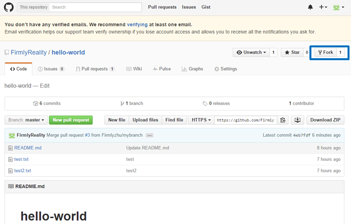

# git&github使用简介

github是目前最常用的代码托管平台，利用它可以实现代码的托管、开源项目的开发和维护等等。而git是其配套使用的客户端。在这里，我们将学习了解git&github的工作方式，并学会使用git&github发布自己的工作，从而参与开源项目的开发。

<hr>

<a name="concepts"></a>
## 基本概念

在github中，往往把一个完整的包含代码、资源等文件的集合称为仓库（repository）或代码库。

在github的常见工作模式中，一个开源项目常有三种仓库。如下图。


**官方仓库**：又可称中央仓库、正式仓库等。是项目维护者在服务器维护的仓库，也是项目的主仓库。对于开源项目来说，该仓库对所有人公开，所有开发者可以查看该仓库代码，也可以从这个仓库中拷贝代码。对于单个项目是唯一的。

**个人公开仓库**：开发者个人在服务器端维护的仓库，往往从官方仓库分支(fork)后产生。官方库从开发者公开仓库“拉(pull)”代码(仓库同步)需要开发者提交pull request，项目维护者审核通过了才会把开发者公开仓库的代码更新到主库里。该仓库每个项目开发者拥有一个。

**个人本地私有仓库**：开发者个人在本地维护的仓库，往往从个人公开仓库克隆(clone)中产生。本地仓库不能直接推送(push)代码到主库，而只能先推送到个人公开仓库，再发起pull request。但是可以直接从主库“拉”更新代码到本地库中。本地库每个项目开发者可能拥有多个。

注：『官方』仓库的叫法只是一个约定，理解这点很重要。从技术上来看，各个开发者仓库和正式仓库在`github`看来没有任何区别。事实上，让正式仓库之所以正式的唯一原因是它是项目维护者的公开仓库。

<a name="pushwork"></a>
## 使用git&github发布自己的工作

本部分主要介绍如何使用git和github发布自己的工作，向主库提交自己的代码文件。

### 开发者Fork官方仓库

想要向主库贡献自己的代码，首先需要在服务器端上分支(Fork)产生出个人公开仓库。github上可以通过web端的按钮实现Fork操作。如下图。



### 从个人公开库克隆出本地库

下一步，开发者需要克隆自己的公开库到本地，以方便自己在本地进行编写代码等开发工作。在本地机器的命令行上使用下面的命令克隆服务器端的仓库到本地：

```
git clone <服务器端仓库URL>
```
在github中个人库的首页上可以找到仓库URL，如下图。


 
### 在本地进行开发工作并提交修改

在本地开发完成后，在项目根目录中使用以下命令将修改加入到暂存区：

```
git add <文件或文件夹路径>
```

若使用：

```
git add .
```

则是将当前目录（包括子目录）中的所有修改加入到暂存区。

加入到暂存区之后，使用以下命令确认修改，并将修改提交到本地仓库：

```
git commit -m '<此次修改的说明>'
```
提交到本地仓库后，再使用推送(push)命令，将修改推送到个人的服务器端仓库：

```
git push origin master
```
推送时需要填写本人的github账户和密码。

### 直接在网页端提交修改到个人公开库

github还提供了通过网页直接在个人公开库上修改的办法，这种办法可以方便的让开发者上传少量文件，或进行一些较为简单的修改。

点击如下按钮便可在当前显示的目录上创建新文件：


点击后便进入编辑界面，编写完成后（内容和文件名皆不能为空），可以在页面底部，点击如下按钮提交修改：


另外，也可以在个人库首页点击upload files按钮直接上传文件到当前目录。

可以看出，网页端仅支持创建和上传操作，更多复杂的修改不支持（创建文件夹，文件移动），大量的修改也较为麻烦，因此不建议使用这种办法提交修改到公开库，而建议使用前一种在本地开发的办法。

### 将代码提交给官方主库

想要将个人公开库中的代码推送到主库，必须向主库发起pull request，github网页端可以在点击如下按钮发起pull request。


点击后，跳转到如下界面：


点击右下角确认按钮后，跳转到如下界面：


显示此页面后，即表示pull request提交成功，待项目维护者审核通过，即可合并入主库。

### 更新个人库

当已经分支（fork）出了个人公开库之后，以后每次开发前都需要同步最新的代码到自己的库中（包括本地和服务器端）。同步的办法是使用`pull`命令。由于服务器端无法直接进行pull操作，因此需要先将主库代码更新到本地库，然后再将本地库代码更新到个人的公开库中。该过程具体为：

首先，在本地命令行上，关联主库并建立upstream别名：

```
git remote add upstream <官方主库URL>
```

关联后，便可直接执行以下更新(拉)命令(以上关联命令只需在首次更新前执行)：

```
git pull upstream master
```

以上命令便会将官方主库的代码更新到本地库中，然后再将本地仓库的更新推送到个人公开库：

```
git push origin master
```

随后，便可按照前述步骤在本地进行编辑开发，然后提交修改到本地库和服务器端库，最后发起pull request，向主库提交代码。

<a name="gitcmd-intro"></a>
## git常用命令简介

### 暂存区, add, commit

- 暂存区是用来暂时存放准备提交的修改的地方

- `git`里提交一个修改到本地仓库里分为两步，首先用`git add`提交到暂存区:
```
git add <文件路径>
```
如```git add abc/test.txt```将abc文件夹中的test.txt文件加入到暂存区。

- 然后`git commit`将暂存区的修改提交到本地分支里:
```
git commit -m "Add some features."
```

- `-m`参数是添加此次修改的描述，如果不加该参数，提交时也会自动启动编辑器来添加描述。

- 如果还要提交到远程仓库（如`github`），还要使用`git push`。

### status, log

- `git status`可以查看当前暂存区的状态，可以看到哪些文件被修改了，哪些修改被提交了，哪些没提交。查看不到已经`commit`的修改。


- `git log`可以查看最近的`commit`的记录，如下图：


### push, pull

- `commit`之后只是将修改提交到本地仓库里，如果需要提交到远程的`github`仓库，还需要`git push`命令:
```
git push <远程仓库名>  <远程分支名>:<本地分支名>
``` 

- 如果不加冒号就是推送当前分支，比如: ```git push origin master```，如果只是`git push`，那就是默认推送到同名分支。

- pull命令是将远程仓库的更新合并到本地分支里，格式与push相同。

- 如果不加冒号就是更新当前分支，如：`git pull origin master`，如果不加参数默认对全部分支更新。

<a name="git-for-linux"></a>
## git For Linux

在Linux系统中，可以用apt-get命令安装git:

```
sudo apt-get install git
```

或是在github上下载linux版本进行安装。安装之后便可直接在Linux终端中使用git命令。

<a name="git-for-windows"></a>
## git For Windows

可以在[https://git-for-windows.github.io/](https://git-for-windows.github.io/)下载git的windows版本。

下载后进行安装，安装时所有安装选项都按默认选项即可完成安装。

安装完成后，打开windows的命令行终端，即可在这个终端中执行上述git命令。注意结合windows本身的命令一起使用。也可以打开git自带的bash呈现执行git命令。
