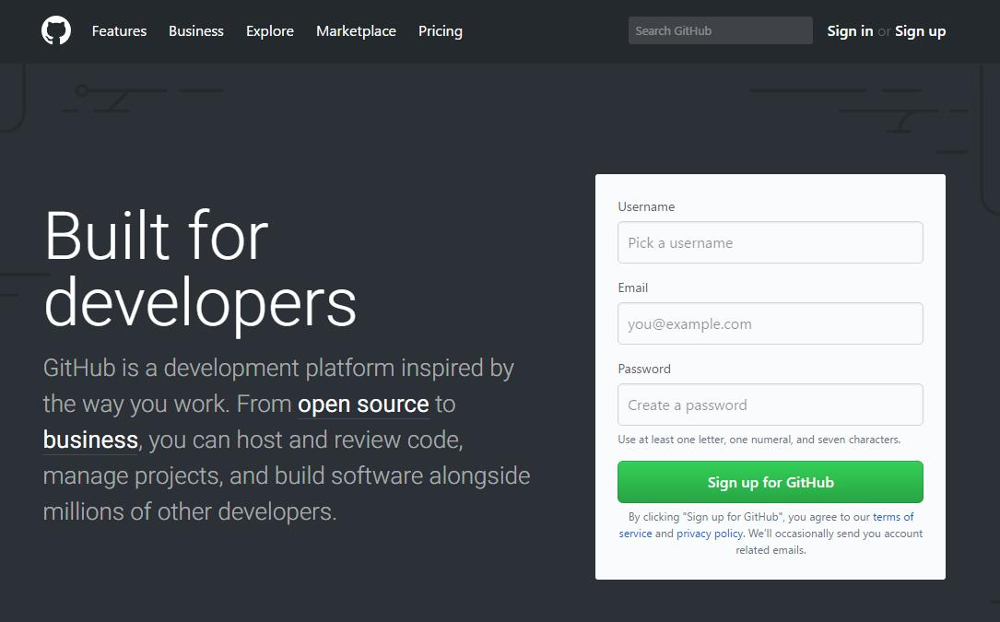
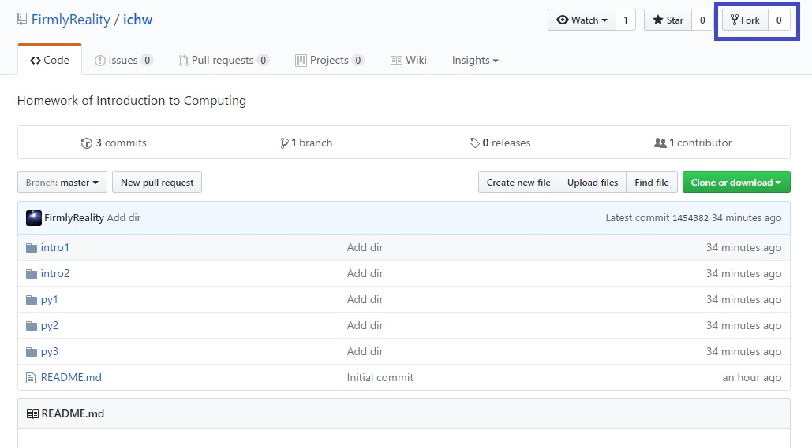
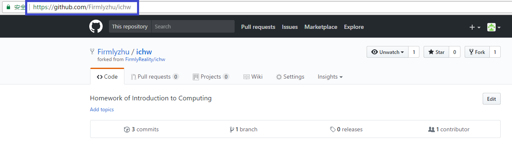
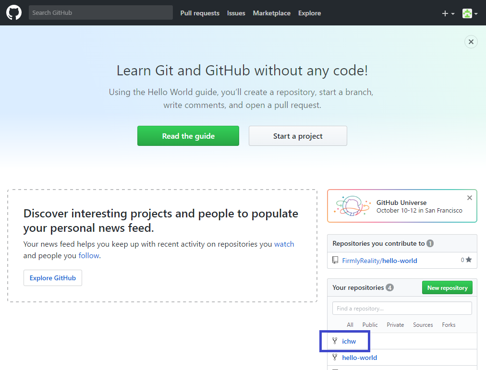
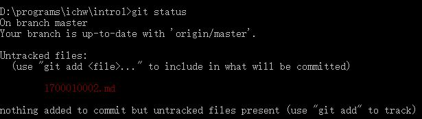
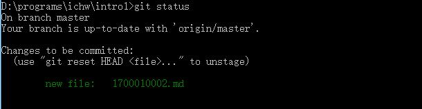
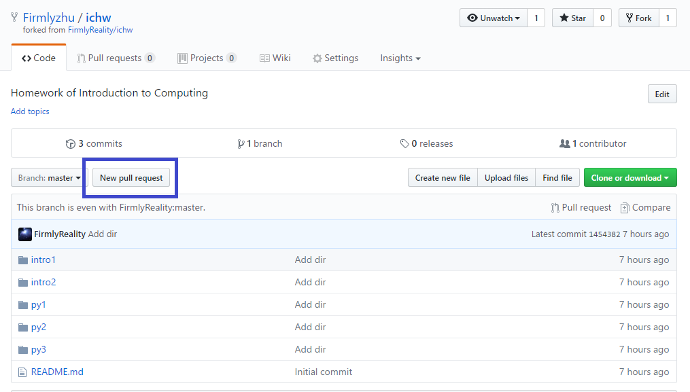
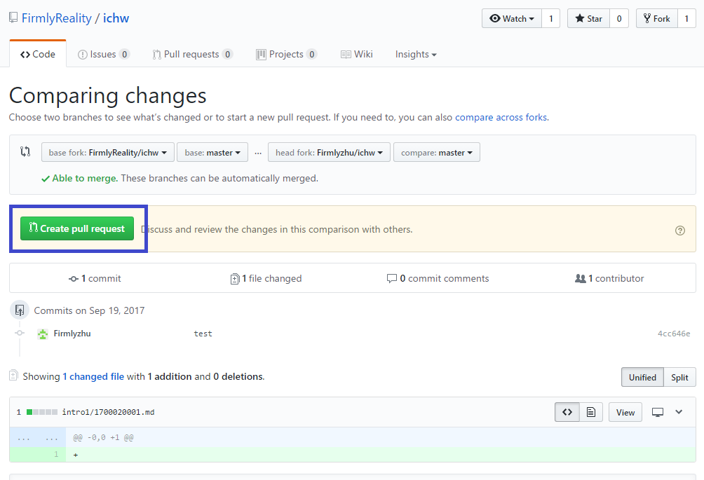
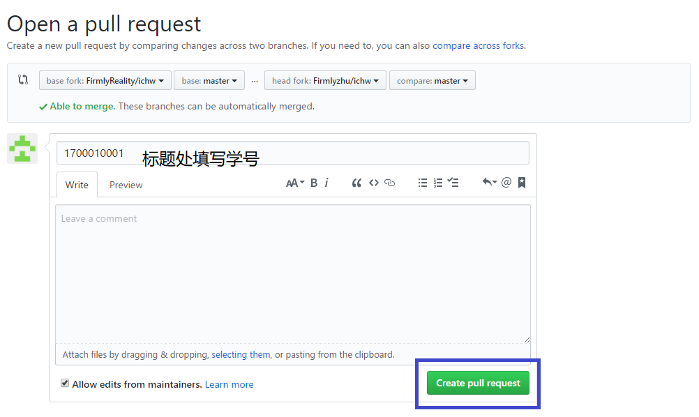
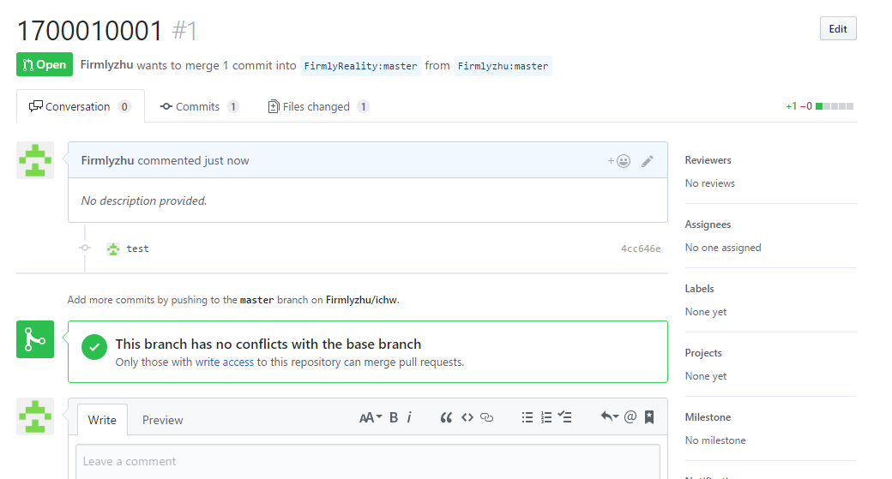

# 作业提交说明

本课程的部分作业使用github和git进行提交，这里将会具体讲述如何提交这些作业。

## 1. github账号注册

在github网站([https://github.com](https://github.com))首页即可完成快速注册（如图），或者点击首页右上角的Sign up进行注册。注册时的选项默认即可。



## 2. 分支（Fork）作业仓库

注册后登录。在搜索框搜索"**ichw**"，找到课程首页助教的仓库, 假定助教的github账号为 "FirmlyReality", 则找到 “**FirmlyReality/ichw**”这个仓库。或者点击 [https://github.com/FirmlyReality/ichw](https://github.com/FirmlyReality/ichw) 可以直接跳转到该作业仓库的首页（如图）。



然后点击右上角蓝框内的Fork按钮，即可将作业仓库克隆到自己账号上。

## 3. 安装git客户端

在Linux系统中，可以用apt-get命令安装git:

```
sudo apt-get install git
```

在Windows系统中，可以在[https://git-for-windows.github.io/](https://git-for-windows.github.io/)下载git的Windows版本。

下载后进行安装，安装时所有安装选项都按默认选项即可完成安装。

## 4. 使用git克隆作业仓库到本地

在本地机器上启动命令行工具(win 10系统可以在开始菜单的"Windows系统"中找到"**命令提示符**",其他windows系统也可以在开始菜单中找到，或是利用搜索功能。Linux系统直接打开终端即可)，在命令行中进入到需要存放仓库的目录，然后使用下面的命令便可克隆自己服务器端的仓库到本地：

```
git clone <服务器端仓库URL>
```

自己的服务器端仓库URL也就是自己之前Fork出的作业仓库首页，如下图。



**注意：**Fork出来的仓库在名字底下会有一行小字“Forked from xxxx/xx”，注意与主库进行区别，不要搞错URL。

假定你的github 账号是 **pkuer01**, Fork出来之后的仓库是
**https://github.com/pkuer01/ichw** . 后面的操作请将 **pkuer01** 替换为
自己的github 账号

在命令行下, 输入下述命令来克隆仓库到本地

```
git clone https://github.com/pkuer01/ichw
```

自己分支(Fork)出来的仓库首页可以在github首页上找到并进入（如下图，需要登录）。



在命令行下，克隆之后，Windows 输入 **dir** 命令, Linux/MacOS 输入 **ls** 命令, 发现本地新出现了一个名为 **ichw** 的目录, 这就是克隆的本地仓库。为了以后更新方便，需要将本地仓库与主库进行关联。

首先, 在命令行中，进入到仓库的根目录, 请记住该目录的位置。

```
cd ichw
```

输入 **git remote** 命令观察库的情况, 可能输出如下

```
origin	https://github.com/pkuer01/ichw (fetch)
origin	https://github.com/pkuer01/ichw (push)
```

然后，输入下述命令即可进行关联：

```
git remote add upstream https://github.com/FirmlyReality/ichw
```

## 5. 更新本地仓库

前面4步为首次提交作业需要做的工作，如果之前第一次提交作业时已经完成了前面4步，那之后每次提交作业只需从第5步做起。

每次对本地仓库进行修改前，都需要与主库进行同步。在命令行中，进入到本地仓库的根目录 (如何进入, 请参阅[使用命令行工具](cmd.md))，使用下面命令与主库进行同步：

```
git pull upstream master
```

如果显示"Already up-to-date."则表示已经是最新的版本，而如果显示"x file changed, x insertion(+)"则表示此次更新了x个文件，有x行的更改。但若显示"conflict"，则表示更新时发现冲突，更新不成功。

更新时发生冲突的原因是之前提交的修改没有合并到主库里，如果这些修改是不再需要的，可以直接删除本地仓库（文件夹），从第4步开始重新进行克隆，然后再进行上述更新，如果还是不行，请联系助教进行解决。

更新之后，可以及时将更新再"push"到服务器端的个人库里：

```
git push origin master
```

也可以选择此次修改完成后，一并推送到服务器端。

## 6. 本地开发修改

可以看到作业仓库里，已经按照不同的作业分好了文件夹：“intro1”,"intro2","py1","py2","py3"。在自己机器上编写完成作业后，请将作业拷贝到本地的作业仓库里的对应文件夹。

作业文件名为“学号.后缀”，比如学号为1700010001的同学，第一次作业放到intro1文件夹中，取名为"1700010001.md"。若要提交多个文件的同学，请创建一个名为自己学号的文件夹，然后在其中放置自己的作业文件。

作业文件放好后，使用`git add <文件名>`命令将新文件放入暂存区，如：

```
git add 1700010001.md
```

上述命令会将1700010001.md加入暂存区。若有多个文件，可以执行多次，也可以执行下述命令，将当前目录的所有新文件加入暂存区：

```
git add .
```

没加入暂存区前，使用`git status`命令会看到如下效果：



加入暂存区后，则会看到如下效果：



更多git的功能和命令，如：版本回退、分支管理等等，请百度“git教程”。

## 6. 提交修改到服务器端的个人仓库

加入暂存区后，输入下述命令在**本地**确认提交修改：

```
git commit -m "此次修改的描述"
```

引号中的内容为本次修改的描述，比如改了哪些文件，添加了什么功能等等。这个内容可以使用`git log`查看到。

然后使用下面命令，将此次修改推送更新到服务器端的人仓库：

```
git push origin master
```

输入上述命令后，需要输入github的账号密码进行登录。推送到服务器端的个人库后才可以更新到主库。

## 7. 将作业提交到主库

作业提交到服务器端的个人仓库后（就是每个人Fork主库出来的仓库），可以在自己的个人仓库首页点击如下蓝框中的按钮发起pull request。个人仓库首页如何进入可以参见第4步。



点击后，会跳转到文件比较页面，确认提交的作业无误后（保证文件名为学号，作业放在正确的文件夹内，否则不予通过），点击页面中间的"Create pull request"（如图）。



点击后会打开如下pull request填写页面，每次作业的pull request的标题请填写“**学号**”，如下图，确认无误后点击右下角蓝框中的按钮提交pull request。



点击后会跳转到如下页面，表示提交pull request成功。作业提交后请常关注这个页面，若是有文件放错位置或文件名不对等问题，助教会在此页面及时反映（也会有邮件进行通知），同学们修改后，再重新提交一次Pull request。



若此次提交没有问题，助教会让pull request通过，代码会合并到主库里，此次作业提交完成。
