class: center, middle

# 01. 课程导论

### 计算概论B (化学)

&nbsp;
&nbsp;

#### 曹东刚 (caodg@pku.edu.cn)  

办公室: 理科1号楼1809

http://sei.pku.edu.cn/~caodg/course/ic

---

## 本讲内容

### <font color="orangered">1. 课程介绍</font> 

### 2. 认识计算机

### 3. 使用计算机

---

## 课程目标

### 面向非计算机专业理科学生

- ### 入门: 熟练使用计算机
 
- ### 提高: 了解计算机的原理与基础知识

- ### 创造: 程序设计方法与技术

---

## 课程内容

### 1. 计算机科学导论

- 计算机的使用
- 计算机科学基本概念与知识
    * 计算机组成原理
    * 计算机硬件、软件、网络的基础知识

### 2. 程序设计方法与技术

- 熟练掌握 Python 语言
- 进行相应的程序设计实践

---

## 教学方式

### 课堂学习

- 计算机科学导论 15 学时
- Python程序设计 33 学时

### 上机实习

- 第三周开始在计算中心机房
- 助教、教师现场答疑、互动 

---

## 考核方式

- 导论作业 20%

- Python作业 30%

- 期末考试 50%

---

## 参考书 

- 计算机科学导论, Behrouz A. Forouzan, 机械工业出版社

- 像计算机科学家一样思考Python，Allen B.Downey 著；赵普明 译，人民邮电出版社

- Think Like a Programmer: An Introduction to Creative Problem Solving, V. Anton Spraul, No Starch Press, 2012

- <font color="orangered">Introduction to Computation and Programming Using Python, Revised and Expanded Edition, John V. Guttag, The MIT Press</font>

---

## 内容提要

### 1. 课程介绍

### <font color="orangered">2. 认识计算机</font> 

### 3. 使用计算机

---

## 计算(Computing)

### 定义

- 广义: In a general way, we can define computing to mean any goal-oriented activity requiring, benefiting from, or creating **computers**. [ACM _Computing Curricula 2005_]

--

- 狭义: The discipline of computing is the systematic study of algorithmic processes that describe and transform information: their theory, analysis, design, efficiency, implementation, and application. The **fundamental question** underlying all computing is "_What can be (efficiently) automated?_" [ACM report on _Computing as a Discipline 1989_]

--

- 也是算数(calculating)和计数(counting)的同义词

---

## 计算机(Computer)

### 定义

A computer is a device that can be instructed to carry out an arbitrary set of arithmetic or logical operations automatically. [_Wikipedia_]

### 词源

**起源**: *The Yong Mans Gleanings, 1613*, 意指 "one who calculates"

**近代**: 1897, "calculating machine"

**现代**: 
  - 1937, Turing machine
  - 1945, "programmable digital electronic computer"

---

## 计算机的模型 

《计算机科学技术百科全书》

计算机是一种现代化的信息处理工具. 它对信息进行处理并提供所需结果, 其结果 (输出) 取决于所接收的信息 (输入) 及相应的处理算法.

&nbsp;
&nbsp;

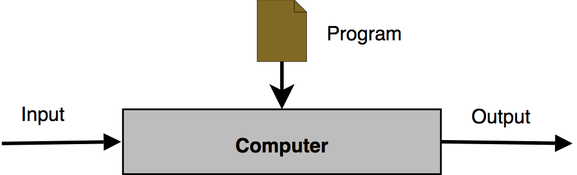

---

## 计算机如何工作 

可归纳为 **IPSO**

- Input : 从输入设备读入信息 
- Process (The 3 C’s)
    - Calculate Compare Copy
- Storage : 将数据存放到内存或外存 
- Output : 输出到输出设备

&nbsp;
&nbsp;


---

## 计算/计算机的历史

计算的历史(\*)比计算机(硬件)的历史要长，计算机的发展是主线

围绕解决输入、处理、输出、通信等问题, 可划分为 4  个时代

- 机械式之前: Premechanical

- 机械式: Mechanical

- 电子机械式: Eletromechanical

- 电子式: Electronic
                                                     
.footnote[https://en.wikipedia.org/wiki/Timeline_of_computing]

---

## The Premechanical Age: 3000 B.C - 1450 A.D 

- 通信: 书写  字母表 
- 输入: 纸  笔 
- 存储: 书籍  图书馆 
- 计数系统 
- 计算设备: 算盘

.left-column[
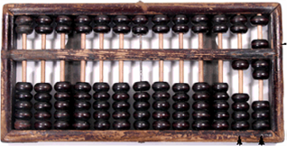

中国算盘
]

.right-column[
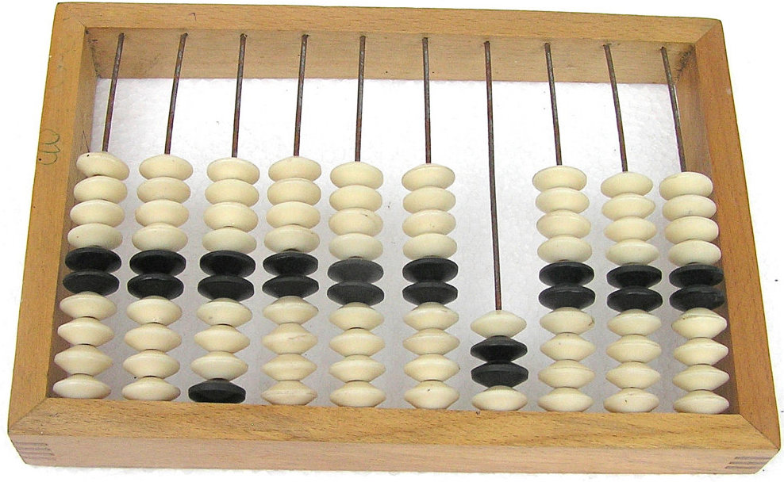

俄罗斯算盘
]
---

## The Mechanical Age: 1450 - 1840

- 1450, Johann Gutenberg 发明金属活字印刷系统
    - 第一次信息爆炸
- 1623, 德国Schikard发明了第一个机械式计算器, 被开普勒应用
- 1642, 法国Pascal发明了齿轮式加减法器
- 1673, 德国数学家 Leibniz 发明了乘除器

.left-column[
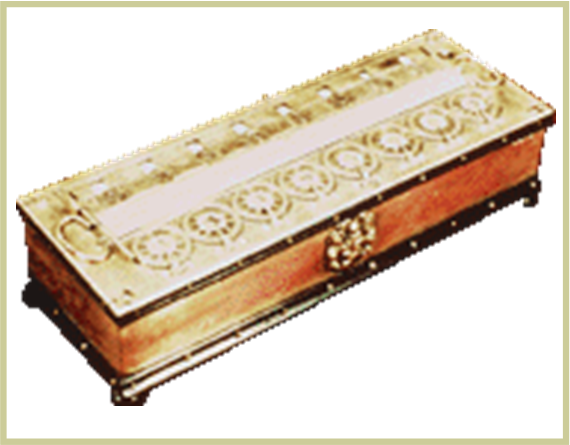

Pascaline 正面
]

.right-column[
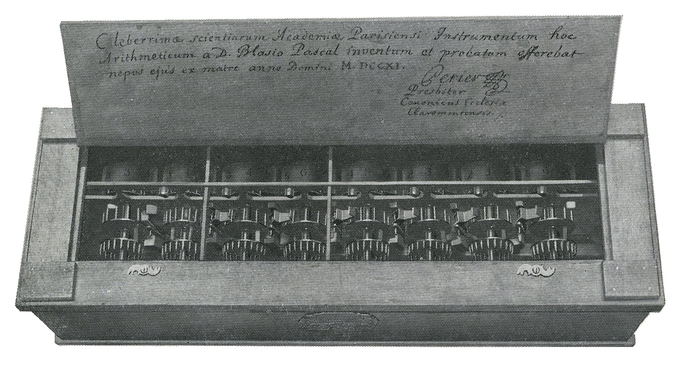

Pascaline 背面
]

---

## Babbage的机械式计算机器

C. Babbage (1791-1871): 英国博学家, 提出了.ored[可编程计算机]的概念, 有人
认为他是 *"father of the computer"*. 

1821年设计了差分机 (difference engine),  用于多项式求值, 由
于条件所限没有成功.  

之后开展通用可编程的机械式计算机---分析机(Analytical Engine)的发明, 用穿孔卡片技术输入, 有很多设计和现代计算机相近.

.left-column[
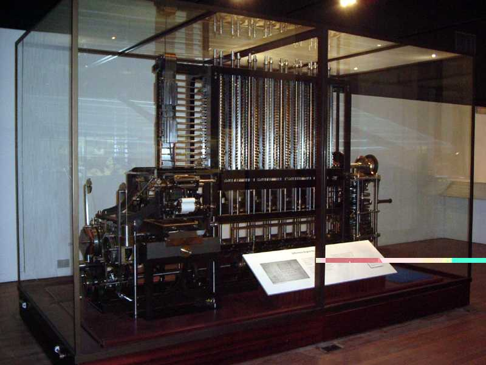

Difference engine 
]

.right-column[
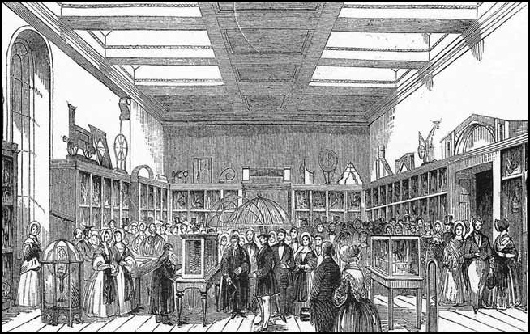

Analytical Engine
]

---

## Babbage的支持者: Ada Byron

Augusta Ada King, Countess of Lovelace (1815-52): 数学家, Babbage研究分析机的助手, 她为分析机设计了计算 "Bernoulli numbers"的算法, 她因此被认为是"*the first computer programmer*".


&nbsp;
&nbsp;

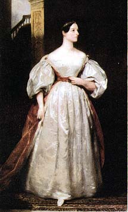

---

## Ada 的算法笔记

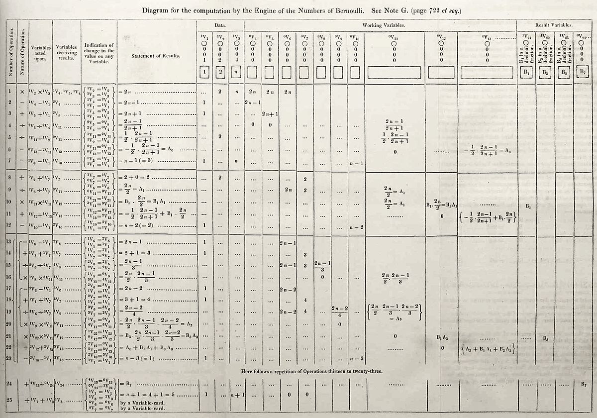


---

## The Electromechanical Age: 1840 - 1940.

The Beginnings of **Telecommunication**

- Voltaic Battery

- Telegraph

- Morse Code

- Telephone and Radio

---

## Herman Hollerith, IBM

Herman Hollerith (1860-1929): 统计学家, 发明了用穿孔卡片进行数据统计的机器, 被认为是 "*father of modern data processing*". IBM公司的创始人之一.

.left-column[
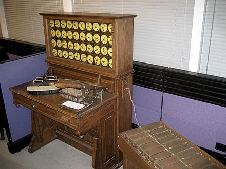
]

.right-column[
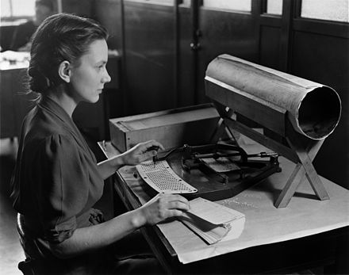
]

---

## 电子机械式计算设备不断出现

- 德国Konrad Zuse's Z-series
    - 世界上首批程序控制通用数字计算机
    - 采用二进制, 电子机械式

- 美国 Mark 1 
    - 纸带存储程序指令和数据


&nbsp;
&nbsp;

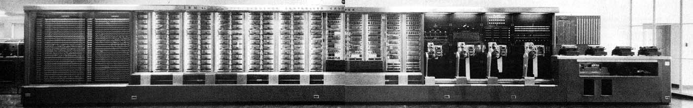

---

## 理论计算的突破: 图灵与图灵机

Alan Turing(1912-1954): 英国开创性的计算机科学家, 数学家, 逻辑学家, 密码学家, 理论生物学家, 马拉松爱好者. 

图灵提出 .ored[图灵机] 通用计算机模型, 将算法和计算的概念形式化, 对计算机科学的发展有巨大影响, 被认为是"*the father of theoretical computer science and artificial intelligence*"

.left-column[
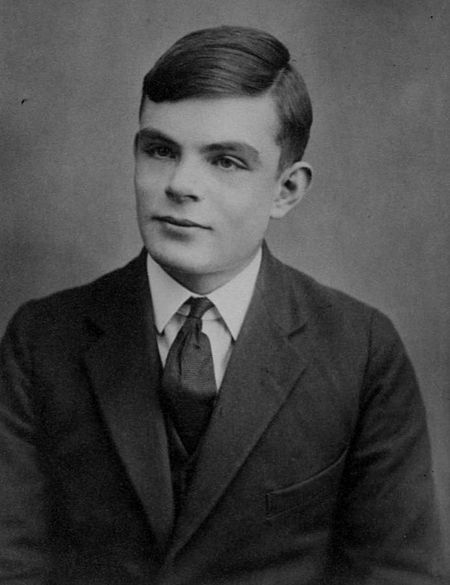
]

.right-column[

]

---

## 图灵机(Turing Machine): 问题提出

.ored[问题]: Hilbert's tenth problem (Entscheidungsproblem: German for 'decision problem'):  能否找到一种普遍的 **算法 (algorithm)**，可用来判定一个任意形式的丢番图方程是否有整数解？ 


.ored[前提]: 算法是通过有限多的步骤对数学函数进行有效计算的方法. 找到算法的前提是找到可以有效计算的函数.

.ored[进展]:  

- Kurt G&ouml;del: The Incomplete Theorem, G&ouml;del-Herbrand general recursive functions

- Alonzo Church: &lambda;-calculus 

- Alan Turing: Turing Machine 

- Church-Turing Thesis

---

## Turing Machine, Universal Turing Machine


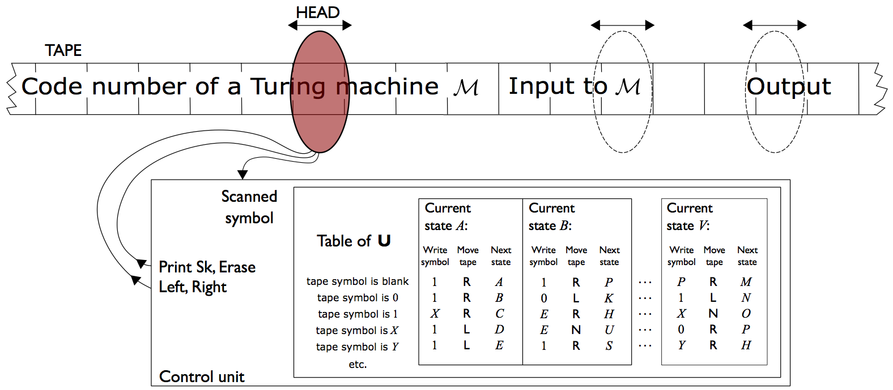

&nbsp;
&nbsp;

Alan Turing, **On Computable Numbers, with an Application to the Entscheidungsproblem**, Master thesis, 1936

---

## 停机问题 (Halting Problem)

.ored[问题]: 对于任何程序及输入, 能否判定其会停机

证明: 反证法

(1). 假定存在这样一个算法 f

```c
boolean f(program, input)
    if ( program halt on input) return true
    else return false
```

(2). 构造 程序 g

```c
boolean g(program)
    if f(program, program) == true
        loop forever
        return false
    else 
        return true
```

(3). 调用 g(g) 结果出现悖论

---

## 停机问题证明的方法: 对角线方法


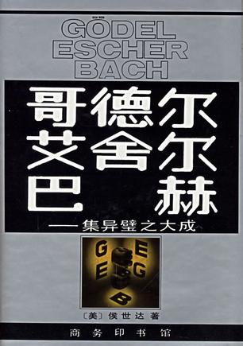

---

## 图灵测试与人工智能(Artifical Intelligence)

.footnote[Alan Turing, **Computing Machinery and Intelligence**, Mind, 1950]

.ored[问题:] "Can machines think"

.ored[转化:] "Can machines do what we (as thinking entities) can do?"

&nbsp;

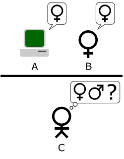


---

## The Electronic Age: 1940 - Present.

1945年, 第一个电子通用计算机ENIAC在宾夕法尼亚大学诞生, ENIAC用了 17468
个电子管, 重 27 吨, 耗电 150 千瓦, 2.4 &times; 0.9 &times; 30m, 每秒5000次十进制加法运算. 

主要设计者J. Presper Eckert是物理学家.


---

## Von Neumann 体系结构

John von Neumann(1903-1957) 考察了ENIAC的后继型号EDVAC后, 于1946年发表了一篇论文
, 给出了计算机内部结构模型与处理过程, 提出了 .ored[存储程序] 的思想

&nbsp;

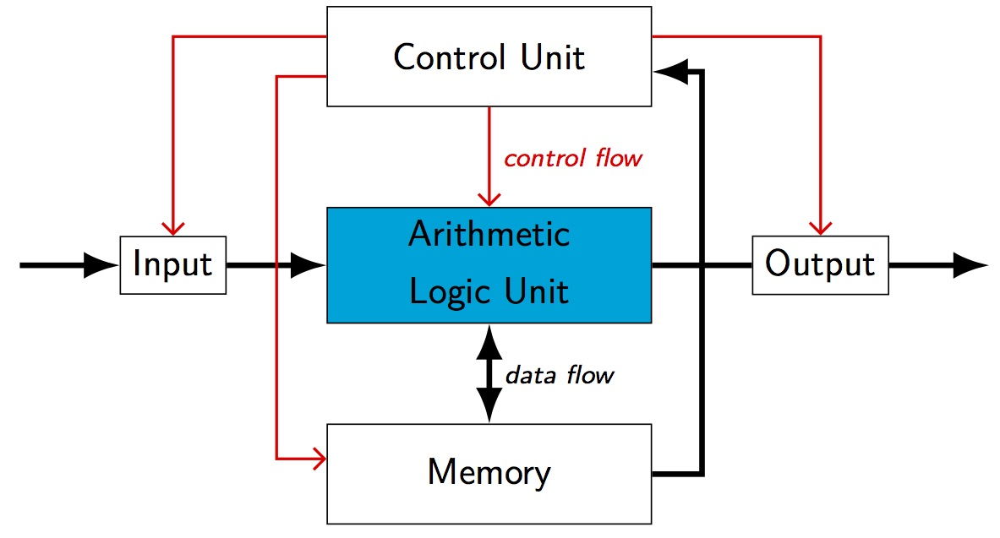

---

## 现代Von Neumann 体系结构计算机

- 第一代, 真空管计算机, 始于20世纪40年代末

- 第二代, 晶体管计算机, 始于20世纪50年代末

- 第三代, 集成电路计算机, 始于20世纪60年代中期

- 第四代, 微处理器计算机, 始于20世纪70年代早期

---

## 第一代: 真空管计算机

.l-side[
- 1948, 曼彻斯特Mark 1, 第一个Von Neumann计算机

- 1951, Remington Rand公司UNIVAC I
    - 美国第一个商用计算机
    - 售出46台, 单价 $1 million

- 1954, IBM 650, 办公桌大小, 单价$50,000

- 1956, IBM售出第一个磁盘存储系统RAMAC, 可存储5M数据, 单价$50,000
]

.r-side[
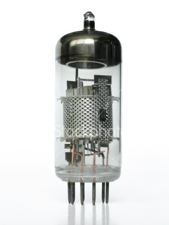
]

---

## UNIVAC

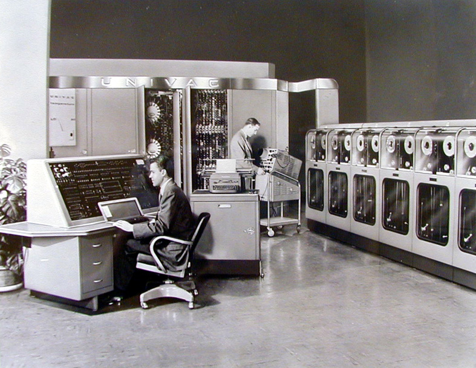

---

## UNIVAC程序员

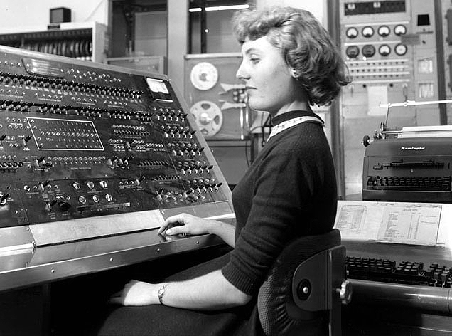

---

## 第二代: 晶体管计算机

.l-side[
- 1959, IBM 发布了晶体管的大型机(mainframe)IBM 7090及稍小的IBM 1401.后者卖了12000台

- 1964, IBM开发成功大型机家族System/360系列
    - 史上最贵的CPU项目: 投资$5 billion (相当于2005年的 $30 billion). 投资很快收回.
    - 最有影响的大型机系列, 在体系结构、操作系统、程序设计等方面做出了巨大创新
]

.r-side[
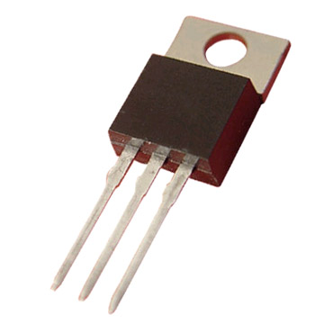
]

---

## IBM 360


---

## 第三代: 集成电路计算机

.l-side[
- 1958, 集成电路发明; 得到应用在5年以后

- 1964, DEC 发布了PDP-8小型机, 是第一个成功的商业小型机(minicomputer)
    - 单价$18,000, 是S/360低端型号的1/5
    - 曾是最畅销的计算机
    - 后期型号采用微处理器(microprocessor)
]

.r-side[
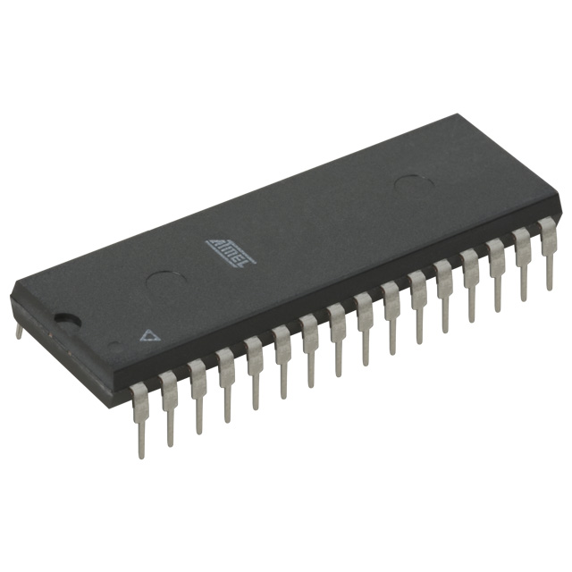
]

---

## DEC PDP-8

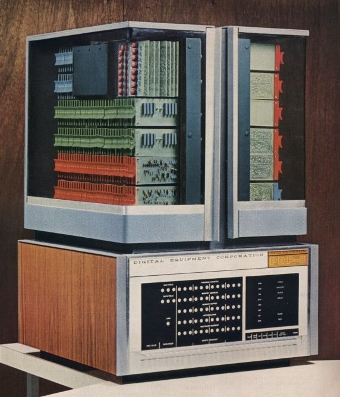

---

## 第四代: 微处理器计算机

.l-side[
- 1971, Intel发布了世界上第一个商业微处理器4004, 每秒60k次运算

- 1976, Seymour Cray公司发布了巨型机 (Supercomputer) Cray-1
    - 每秒150 M次浮点运算, 单价$5 million

- 1973, Xerox PARC发布了第一个个人计算机Xerox Alto，PC时代来临
    - Apple PC, IBM PC, ...
]

.r-side[
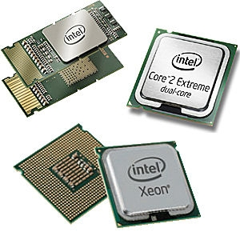
]

---

## 硅谷 (Silicon Valley)与计算工业

.ored[硅谷]：美国加州旧金山湾区的世界最大高科技公司聚居区

- Stanford University, Fredrick Terman

- William Shockley (1910-1989), 发明晶体管, 奠定电子产业基石

- Shockley Semiconductor Laboratory

- "Traitorous eight" and Fairchild Semiconductor
    - 分裂: National Semiconductor, AMD, (Robert Noyce and Gordon Moore) INTEL

- Bell Telephone Laboratories

- Xerox's Palo Alto: Ethernet, Postscript, laser printer, GUI

- HP, 3Com, Adobe, Cisco, Apple, Oracle, Nvidia, Yahoo, Sun, SanDisk, Google, ...

---

## 互联网时代的计算机

.left-column[
- 1960s, 美国ARPANET

- 1980s, TCP/IP, Internet

- 1990s, WWW, 浏览器

- 2000s, 网络即是计算机

- 2010s, 强大的终端, 普适计算
]

.right-column[

]

---

## 互联网时代的计算机: 各种终端

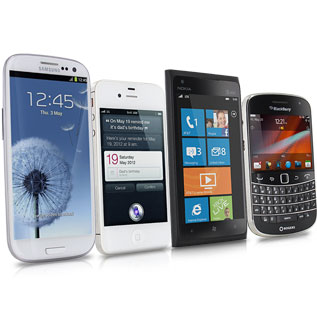

.left-column[
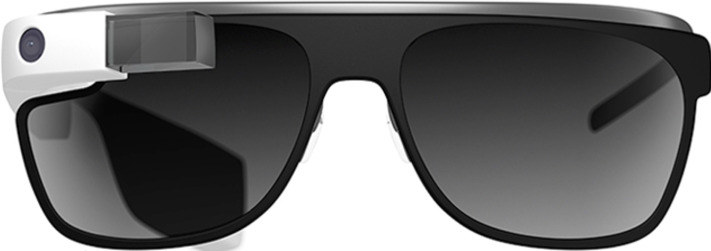
]

.right-column[
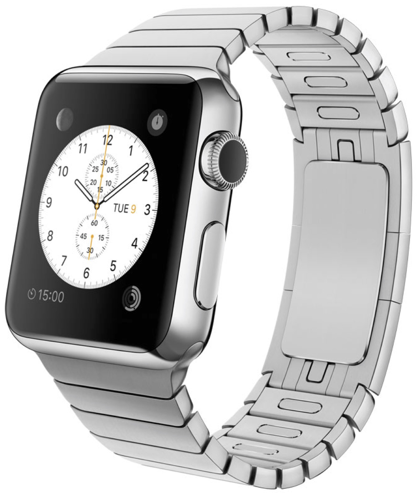
]


---

## 计算机类别及用途

- 微型计算机(微机, Microcomputer)

- 小型计算机(小型机, Minicomputer)

- 大型计算机(大型机, Mainframe computer)

- 超级计算机(巨型机, Supercomputer)

- 专用计算机(Special-purpose computer)/ 嵌入式计算机(Embedded
computer)


---

## 大型机, Mainframe Computer

- 高可靠、高性能、易管理、易维护
- 体积庞大、价格昂贵、服务优良
- 用于政府, 大公司, 银行和科研单位等的关键任务处理

.left-column[
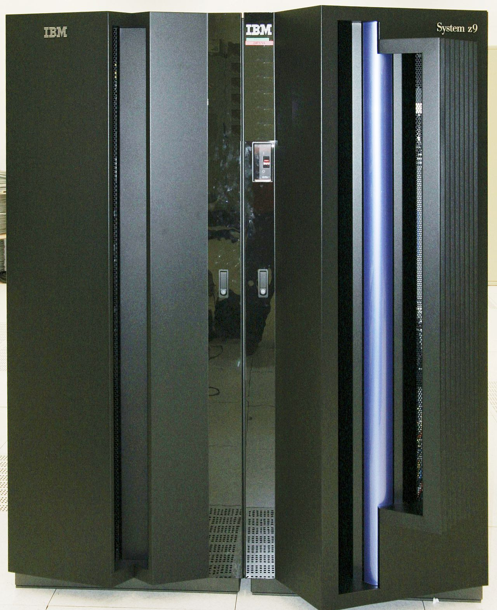
]

.right-column[
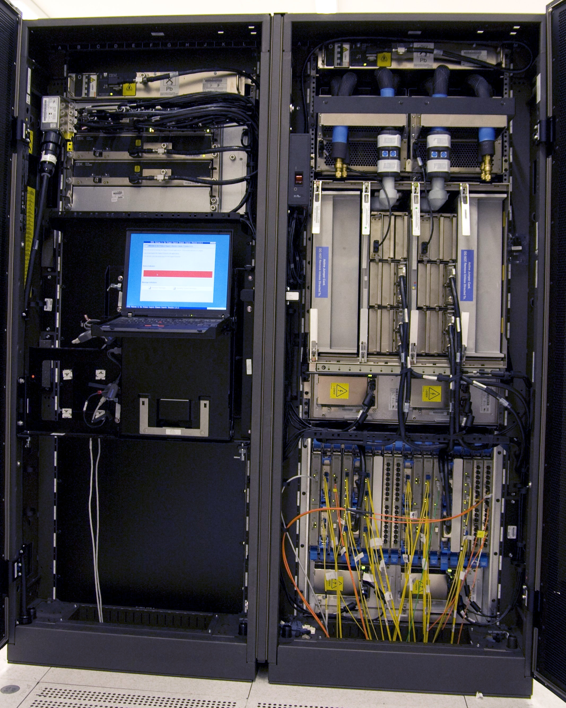
]

---

## 超级计算机, Supercomputer

- 拥有最强的并行计算能力
- 是国家科技水平的重要标志
- 在气象、军事、能源、理论科学、生命等领域承担超大规模科学计算任务
- 软件技术起决定性作用

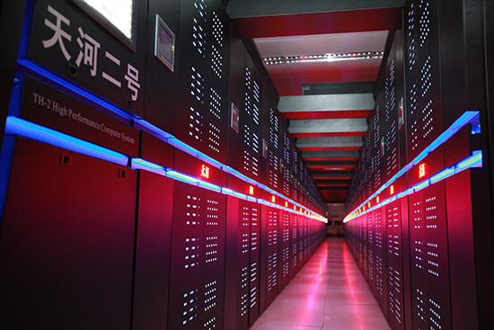

---

## 计算机 vs 人 

.left-column[

1997年, 国际象棋冠军 Kasparov 与 IBM DeepBlue 6 局比赛, DeepBlue 3.5:2.5 获胜

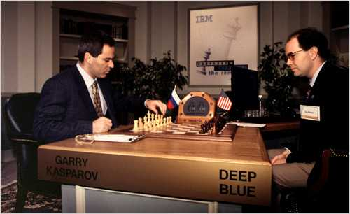

DeepBlue 主要是通过大规模并行暴力计算的方法, 可每秒评估200 m 种位置
]


.right-column[

]

---

## 计算机 vs 人

2016年, Google AlphaGo 与 围棋世界冠军 李世石 5番棋大战, AlphaGo 4:1 获胜.

AlphaGo 使用了机器学习和树搜索技术, 经过了大量的训练.

消耗的计算资源: 1,202 CPUs 和 176 GPUs.

.left-column[

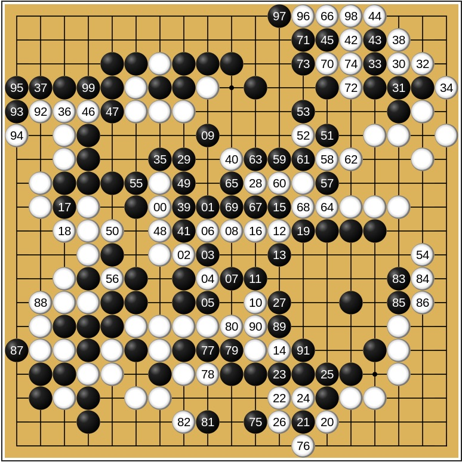
]

.right-column[


Google Cloud Platform
]

---

## 未来: 量子(Quantum)计算机

.left-column[

原理：

量子比特可以制备在两个逻辑态0和1的相干叠加态，即它可以同时存储0和1。

对一个有N个比特的存储器，若它是经典存储器，则只能存储`\(2^N\)`个可能数据当中的任一个，若是量子存储器，则可同时存储 `\(2^N\)`个数

应用：超级并行计算
]


.right-column[


The Bloch sphere, a representation of a qubit
]

---

## 未来: Chemical Computer

From wikipedia: 

A chemical computer, also called reaction-diffusion computer, BZ
computer (stands for Belousov–Zhabotinsky computer) or gooware
computer is an unconventional computer based on a semi-solid
chemical "soup" where data are represented by varying
concentrations of chemicals.

The computations are performed by
naturally occurring chemical reactions. So far it is still in a very
early experimental stage, but may have great potential for the
computer industry.

---

## 未来: DNA Computing

From wikipedia:

DNA computing is a branch of computing which uses DNA, biochemistry
and molecular biology hardware, instead of the traditional
silicon-based computer technologies. DNA computing, or, more
generally, biomolecular computing, is a fast-developing
interdisciplinary area.

---

## 内容提要

### 1. 课程介绍

### 2. 认识计算机

### <font color="orangered">3. 使用计算机</font> 

---

## 熟悉个人计算机

.left-column[
&#9312; Display

&#9313; Motherboard

&#9314; CPU (Microprocessor)

&#9315; Primary storage (RAM)

&#9316; Expansion cards

&#9317; Power supply

&#9318; Optical disc drive

&#9319; Secondary storage (HD)

&#9320; Keyboard

&#9321; Mouse
]

.right-column[
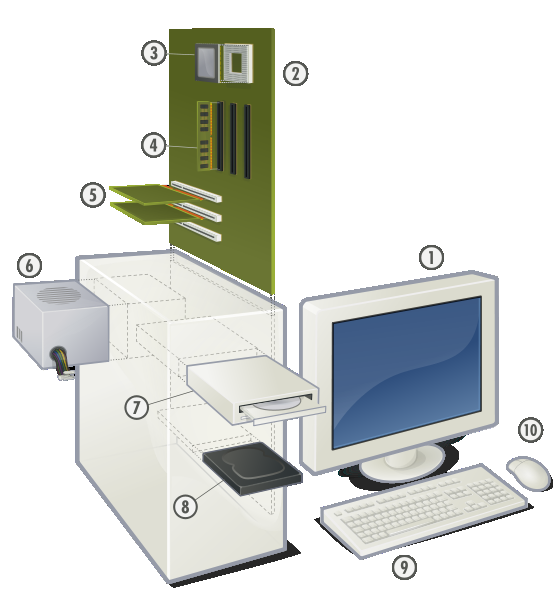
]

---

## 熟悉常用软件

### 操作系统 

Windows,  Mac OS X, Linux

### 应用软件

浏览器: IE(Edge), Safari, Firefox, Chrome 

办公: MS Office, Pages Keynotes Number, 金山 WPS, LibreOffice

阅读器: Adobe Acrobat Reader, Preview

---

class: center, middle

# 谢谢
