class: center, middle

# 02. 数据及其表示

### 计算概论B (化学)

&nbsp;
&nbsp;

#### 曹东刚 (caodg@pku.edu.cn)  

办公室: 理科1号楼1809

http://sei.pku.edu.cn/~caodg/course/ic

---

## 内容提要

### 1. 数据与计数制 

### 2. 整数表示法

### 3. 浮点数表示法

---

## 常见的数据类型

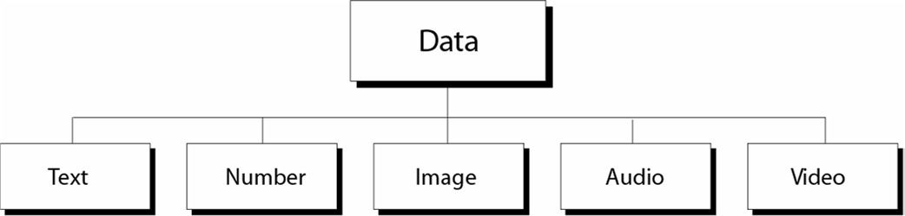

---

## 计算机内的数据表示

计算机内的数据采用统一的数据表示法

- 位(bit): 存储在计算机中的最小数据单位, 0 或 1

- 位模式: 表示数据的位序列, 或位流

- 字节(byte): 长度为8的位模式称为字节

&nbsp;

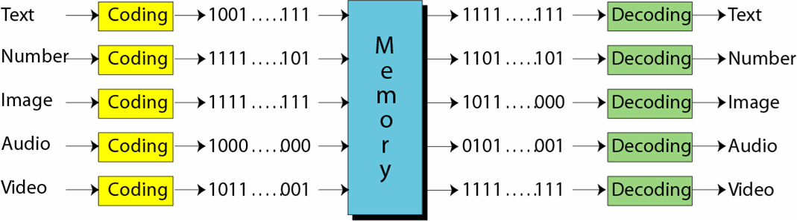

---

# 文本的表示

- 在任何语言中, 文本都是由一些符号组成

- 位模式可以表示任何一个符号

- 需要多少位(bit)来表示一个符号取决于该语言使用的符号的数量

**符号数目**| **位模式的长度**
:------: |  :----------:
2 | 1  
4 | 2 
8 | 3 
16 | 4  
256 | 8 
65536 | 16 

---

## 字符代码-ASCII

存在不同的表示文本符号的位模式集合, 每个集合被称为代码,表示符号的过程称为编码.

**ASCII: American Standard Code for Information Interchange**

- 基于英文, 使用7位表示每个符号, 范围从0000000-1111111

- 只适合表达英语, 不支持其它语种

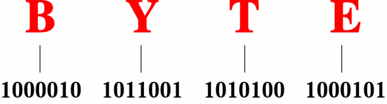

---

## 字符代码-Unicode

**Unicode**: 多语言编码的工业标准

- 17个代码平面(plane), 每个平面`\(2^{16}=65536\)`个符号,目前已包含超过100000个符号

- 平面0(0000–FFFF): Basic Multilingual Plane (BMP)

- 主要的Unicode代码编码方法

    - UTF-8: 1-4个字节, 可变长编码, 兼容 ASCII

    - UTF-16: 2或4个字节, Windows NT, Java采用

---

## 汉字编码字符集

- GB2312--80, 简称国标码

    - 简体汉字, 我国应用最广
    - 汉字6763个, 非汉字图形字符682个

- BIG5, 繁体汉字, 香港、台湾地区

- CJK大字符集, 包含20902个汉字, 中日韩政府、国际标准化组织推动

- GB18030--2000, 完全覆盖并替代GB2312, 包括27484个汉字, 目前的国家标准

---

## 图像

图像在计算机中有两种表示方式: 位图图形或者矢量图形.

### 位图图形(bitmap):

- 图像被分成像素矩阵, 每个像素是一个小点, 每个像素用一个位模式表达

- 对于黑白图像, 1位模式即可. 0表示黑, 1表示白

- 对于彩色图像, 每个彩色像素被分解为三种主色: 红、绿、蓝(RGB), 测出每种颜色的强度, 并把8位模式赋给它

---

## 黑白位图图形

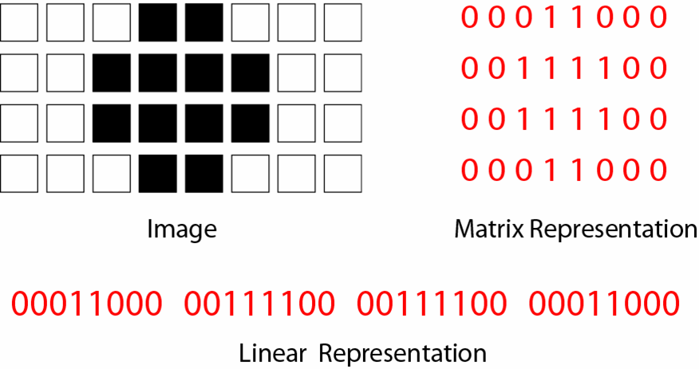

---

## 彩色位图图形

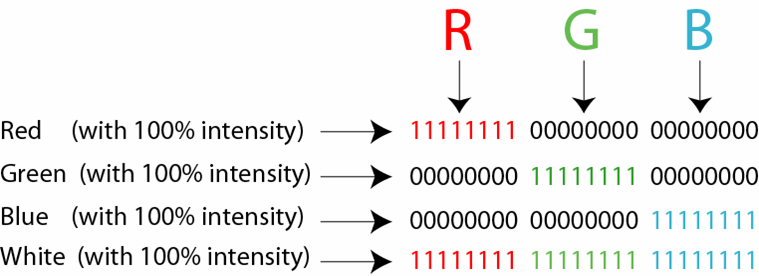

---

## 像素, 分辨率

### 像素(pixel)

图像显示的基本单位

### 图像分辨率

每英寸的像素数目, 以PPI(Pixels per inch)为单位, 也常常表示为每个方向上的
像素数量, 如 640x480 像素 

### 输出分辨率

设备输出图像时, 每英寸可产生的点数DPI(Dots per inch). 数码照片打印一般是200DPI

---

## 像素, 分辨率与输出尺寸

数码相机像素 | 最大分辨率照片 | 以200dpi分辨率输出 | 以300dpi分辨率输出 
--- | --- | --- | ---
50万    | 800×600   |  | 
80万    | 1024×768  | 5”（3.5×5英寸）  |
130万   | 1280×960  | 6”（4×6英寸）    | 
200万   | 1600×1200 | 8”（6×8英寸)     | 5”（3.5×5英寸） 
310万   | 2048×1536 | 10”（8×10寸）    | 7”（5×7英寸） 
500万   | 2560×1920 | 12”（10×12英寸） | 8”（6×8英寸） 
800万   | 3264×2488 | 16”（12×16英寸） | 10”（8×10寸） 
1100万  | 4080×2720 | 20”（16×20英寸） | 12”（10×12英寸） 
1400万  | 4536×3024 | 24”（18×24英寸） | 14”（11×14英寸） 

---

## 显示分辨率(Display resolution)

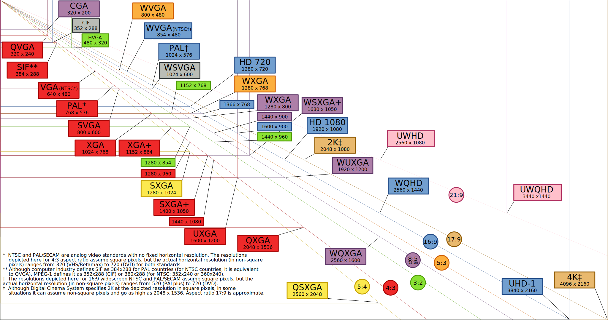

---

## 常见显示分辨率及用户比例(Dec 2015)

Standard | Aspect ratio | Width (px) | Height (px) | % of Steam users| % of web users 
--- | --- | --- | --- | --- | ---
XGA  | 4:3  | 1024 | 768 | 2.05 | 7.49
WXGA | 16:9 | 1280 | 720 | 1.33 | 1.96
WXGA | 16:10| 1280 | 800 | 2.00 | 6.12
HD   |~16:9 | 1366 | 768 | 26.47| 30.05
HD+  | 16:9 | 1600 | 900 | 6.95 | 5.99
FHD  | 16:9 | 1920 |1080 | 35.15| 13.69
WQHD | 16:9 | 2560 |1440 | 1.28 | 1.10
UHD(4K) | 16:9 | 3840 | 2160 |  0.07 | n/a
UHD(8K) | 16:9 | 7680 | 4320 |  2.92 | n/a

---

## 矢量图形

位图图形的问题是改变图形大小时会产生失真

### 矢量图形(vector)

- 将图像分解为曲线和直线的集合, 由数学公式表示

- 系统根据图像尺寸动态计算并画出图像

- 常见矢量图像格式: svg, flash, pdf, ps, Type 1 字体, 等等

---

## 位图 vs 矢量图

---

## 矢量图

---

## 计数制

**进位计数制**: 按进位的方法进行计数, 称为进位计数制

- 十进制, 基数是10, 数码为0-9, 逢十进一

- 二进制, 基数是2, 数码为0-1, 逢二进一

- 八进制, 基数是8, 数码为0-7, 逢八进一

- 十六进制, 基数是16, 数码为0-9与A-F, 逢十六进一

---

## 十六进制, hexadecimal

十六进制表示规则

- 以 16 为进位, 共 16 个符号 (0-9, A-F)

- 每个 16 进制数字表示成 4 个位: 0000-1111

- 写法: 数的前面加 0x(大写或小写), 如 0x11 表示 17 

--

16 进制整数和二进制整数的转化

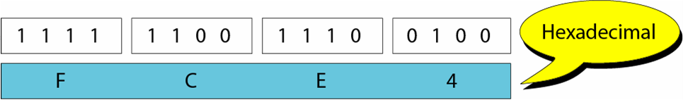

---

# 八进制, octal

八进制表示规则

- 以8为进位, 共8个符号(0-7)

- 每个8进制数字表示成3个位: 000-111

- 写法: 数的前面加 0 (python2) 0o(python3) , 如011/0o11表示9 

--

8进制整数和二进制整数的转化

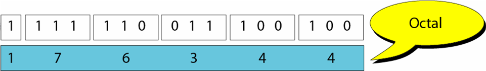

---

## 二进制, binary

二进制表示规则

`\(
\begin{eqnarray*}
    && b_nb_{n-1}\ldots b_1b_0 \\
\mbox{其中:}\\
    && b_n =  1, n > 0 \\
    && b_n \in \{ 0, 1 \}, n = 0  \\
    && b_{n-1}, \ldots, b_1 , b_0 \in \{ 0, 1 \}
\end{eqnarray*}
\)`

该数的十进制值可用下式得出：

`\(b_n \times 2^n + b_{n-1} \times 2^{n-1} + \ldots + b_1 \times 2^1 + b_0 \times 2^0 \)`

---

## 二进制向十进制转换

规则: 将每个二进制位乘以权值后相加

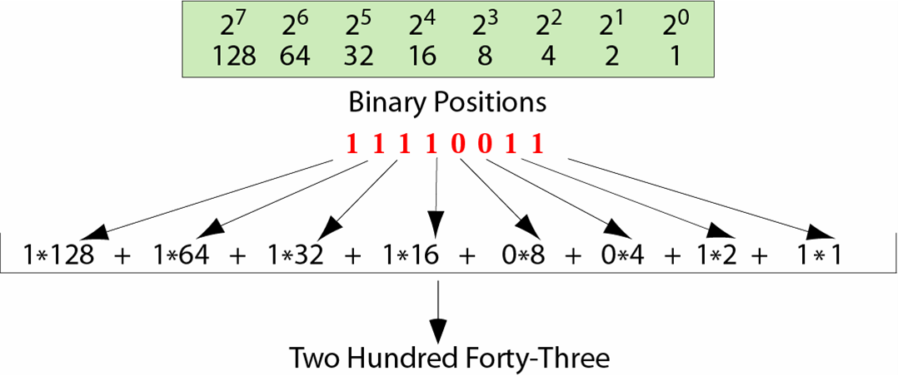

--

例: 将二进制 **0b10011** 转化为 十进制 

答: `\( = 2^4 + 2^1 + 2^0 = 19 \)`

---

## 十进制向二进制转换

规则: 反复采用底数2除法. 即十进制数除以2, 余数作为转换的二进制的第一位, 所得商
继续除2, 直至商为0.

例: 将十进制 **45** 转化为二进制

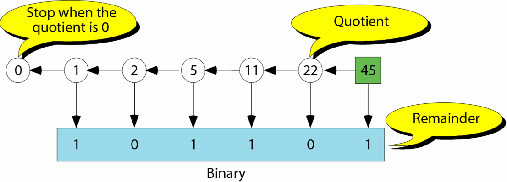

---

## 内容提要

### 1. 数据与计数制

### 2. 整数表示法 

### 3. 浮点数表示法

---

## 整数的表示

整数(integer)是完整的数(whole number)

- 整数的范围: `\(-\infty \longleftarrow 0 \longrightarrow + \infty \)`

整数的表示

- 无符号整数, unsigned integer

- 有符号整数, signed integer

    - 二进制原码, Sign-and-magnitude

    - 二进制反码, One's complement

    - 二进制补码, Two's complement

---

## 无符号整数

计算机会用固定的位数 N 保存无符号整数, 范围为 `\(0 \thicksim (2^N -1) \)`

`\( N = 16, \qquad 0 \thicksim 65535 \)`

`\( N = 32, \qquad 0 \thicksim 4 294 967 295 \)`

用无符号数表示整数

- 首先将整数转换为二进制数

- 如果二进制数不足 N 位, 则二进制左边补 0, 使总位数为 N 位

- 若数的二进制位超过 N, 则溢出(overflow)
---

## 不同的无符号整数存储示例

10 进制 | 8-bit 存储|  16-bit 存储 
----:|:--------| :---------
7 | 00000111 | 0000000000000111  
234 | 11101010 | 0000000011101010 
24760  | overflow  |0110000010111000 
1245678  | overflow  | overflow

---

## 有符号整数: 原码格式, Sign-and-magnitude

原码

- 符号加绝对值, 即将最左边一位用于表示正负, 0为正, 1为负. 其余位表示数的绝对值

- 若计算机整数位长为N, 则原码范围: `\( - (2^{N-1} - 1) \thicksim + (2^{N-1} - 1)\)`

- 有两个0: 正数 0 (`\(+0\)`)和负数 0 (`\(-0\)`)

原码表示范围

Bits number |  Range 
:----: | :----:
8 |  `\( - 127 \thicksim -0 \quad +0 \thicksim + 127 \)`
16 |  `\( - 32767 \thicksim -0 \quad +0 \thicksim + 32767 \)`
32 |  `\( -2147483647 \thicksim -0 \quad +0 \thicksim + 2147483647 \)`

---

## 原码表示与应用

**用原码表示整数**

- 将数的绝对值转换为2进制, 忽略符号
- 如果2进制位数不足 N-1, 则左边补0至 N-1 位
- 如果是正数, 则左边补0; 若是负数, 则左边加1, 变为N 位

例: 用原码法将 `\(-258\)` 保存在16位存储单元中

`\( 258 \rightarrow 100000010 \rightarrow 000000100000010 \rightarrow \textbf{1}000000100000010 \)`

--

**应用**

- 计算机中并不采用原码表示法
    - 不方便进行加减
    - 有两个0
- 可用于非数值计算领域, 例如模拟信号采样

---

## 反码, One's complement

数的反码形式: 0换为1, 1换为0

- 二进制反码表示法: 正数采用原码表示法, 负数采用正数的反码形式

- 反码的最左边的位定义正负符号: 0为正

- 表示范围: `\( - (2^{N-1} - 1) \thicksim + (2^{N-1} - 1) \)`

- 反码同样有两个0:  00000000 和 11111111

---

## 用反码表示整数

方法

- 将数的绝对值转换为 2 进制, 忽略符号

- 左边补 0 至 N 位

- 如果是正数, 则停止; 若是负数, 则每位取反

--

例：求反码 11111110 的十进制表示

`\( 11111110 \rightarrow 00000001 \rightarrow -1 \)`

--

例：求 十进制整数 -127 的 8-bit 反码

`\( -127 \rightarrow 01111111 \rightarrow 10000000\)`

---

## 反码的应用

- 现代计算机中并不采用反码表示法(早期曾采用)

    - 不方便进行加减

        - 将进位加到结果里才能得到正确结果

        - 思考: `\( -2 + 3 = ? \)` 

    - 有两个0

- 可用于纠错、码位校验

---

## 补码, Two’s complement

补码解决了反码存在的问题, 是现在应用最广泛的整数表示法

- 在给定码长 N 的情况下, 求数-n 的补码, 就是求一个二进制数 `\(n'\)`,
使得`\( n + n' = 2^N \)`

对于整数 X，设 `\([X]\)` 是其补码表示, N 是码长, 则

`\(
  [X] = \left\{ \begin{array}{l@{\quad:\quad}l}
    X & 0 \leq X \leq 2^{N-1}-1 \\
      2^N - |X| & -2^{N-1} \leq X < 0
        \end{array} \right.
\)`

- 补码只有一个0

---

## 求补码

- 正数补码: 和原码相同

- 负数补码: 反码加 1

--

例: 码长为8, 求 **-25** 的补码

`\( 原码~~10011001 \longrightarrow 反码~~11100110 \longrightarrow 加1~~11100111 \)`

--

例: 将二进制补码 **11101110** 转换为十进制整数

`\( 补码~~11101110 \longrightarrow 求反~~10010001 \longrightarrow 加1~~10010010 \longrightarrow 结果~~\mbox{-18} \)`

---

## 补码的运算

运算法则: 两个数相加减, 进行包括符号位在内的补码相加

设 `\([X]\)` 是 X 的补码, 则

- `\( [X+Y] = [X] + [Y] \)`
- `\( [X-Y] = [X] + [-Y] \)`

--

例: 码长 4 位, 求 `\(2 − 3\)`

`\( 2的补码~~0010 \longrightarrow \mbox{-3的补码}~~1101 \longrightarrow 结果~~ 1111 \longrightarrow \mbox{-1}\)`

--

例: 码长4位, 求 `\(3 - 2\)`

`\( 3的补码~~0011 \longrightarrow \mbox{-2的补码}~~1110 \longrightarrow 结果~~ 0001 \longrightarrow \mbox{1}\)`

---

## 各种格式比较(码长4位)

.left-column[

十进制 | 无符号 | 原码 | 反码 | 补码  
:---: | :---: | :---: | :---: | :---:
+8 | 1000 | N/A | N/A | N/A 
+7 | 0111 | 0111 | 0111 | 0111 
+6 | 0110 | 0110 | 0110 | 0110 
+5 | 0101 | 0101 | 0101 | 0101 
+4 | 0100 | 0100 | 0100 | 0100 
+3 | 0011 | 0011 | 0011 | 0011 
+2 | 0010 | 0010 | 0010 | 0010 
+1 | 0001 | 0001 | 0001 | 0001 
(+)0 | 0000 | 0000 | 0000 | 0000 
]

.right-column[

十进制 | 无符号 | 原码 | 反码 | 补码  
:---: | :---: | :---: | :---: | :---:
(-)0 | N/A | 1000 | 1111 | N/A 
-1 | N/A | 1001 | 1110 | 1111 
-2 | N/A | 1010 | 1101 | 1110 
-3 | N/A | 1011 | 1100 | 1101 
-4 | N/A | 1100 | 1011 | 1100 
-5 | N/A | 1101 | 1010 | 1011 
-6 | N/A | 1110 | 1001 | 1010 
-7 | N/A | 1111 | 1000 | 1001 
-8 | N/A | N/A | N/A | 1000 
]

---

## 内容提要

### 1. 数据与计数制

### 2. 整数表示法 

### 3. 浮点数表示法 

---

## 浮点数

浮点数(floating point number)既包含整数又包含小数(fraction)

十进制小数转换为二进制: 反复乘2

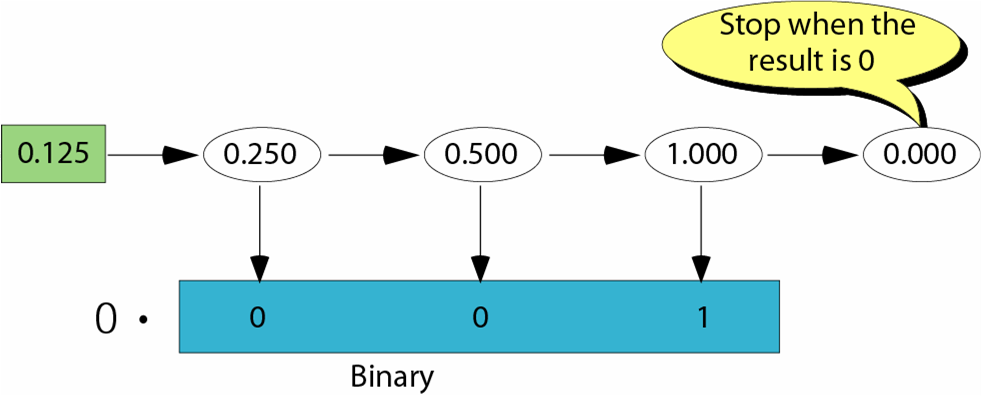

---

## 浮点数规范化, normalization

问题: 如 **(+10011.1011)** 这样的数不利于计算机存储(why?)

规范化: 移动小数点使得小数点左边只有1个 **1**

则: 只需存储符号(sign)、指数(exponent)、尾数(mantissa)

示例:

`\( +1010001.1101 \rightarrow +2^6 \times 1.01000111001 \)`

`\( -0.001110011 \rightarrow -2^{-3} \times 1.110011 \)`

---

## 指数表示: Excess-N 系统

Excess-N 系统用无符号数表示正数和负数, 主要用于存储小数的指数值, 目的是
便于让计算机像比较二进制补码整数一样的方式比较二进制浮点数

- N 被称为biasing value, 用于数据转换.
    - 将整数与正数 N 相加
    - 结果转换为二进制, 补0至码长

例: 码长为4, 用Excess-7 系统表示十进制+8和-7 

`\( +8 : 1111 \qquad \mbox{-7} : 0000 \)`

例: 将Excess-127 系统表示的 11111110 转换为十进制

11111110 十进制为254, 减去127结果为127

---

## IEEE 754 浮点数表示标准 

** 单精度: Excess-127 ** 

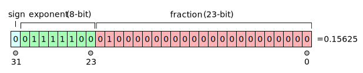

** 双精度: Excess-1023 **

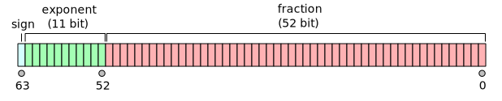

---

## IEEE 754 单精度表示的示例

 Sign  |  Exp | Frac |  Value
--- | --- | --- | ---
*   | 0000 0000 | 000 0000 0000 0000 0000 0000 | ±0.0
0   | 0111 1111 | 000 0000 0000 0000 0000 0000 | 1.0
1   | 0111 1111 | 000 0000 0000 0000 0000 0000 | −1.0
*   | 0000 0000 | 000 0000 0000 0000 0000 0001 | `\(±2^{−23} × 2^{−126} \)`
*   | 0000 0000 | 111 1111 1111 1111 1111 1111 | `\(±(1−2^{−23}) × 2^{−126}\)`
*   | 1111 1111 | 000 0000 0000 0000 0000 0000 | ±∞
*   | 1111 1111 | non zero    | NaN
*   | 0000 0001 | 000 0000 0000 0000 0000 0000 | `\(±2^{−126}\)` 
*   | 1111 1110 | 111 1111 1111 1111 1111 1111 | `\(±(2−2^{−23}) × 2^{127}\)`
