class: center, middle

# 03. 计算机硬件

### 计算概论B (化学)

&nbsp;
&nbsp;

#### 曹东刚 (caodg@pku.edu.cn)  

办公室: 理科1号楼1809

http://sei.pku.edu.cn/~caodg/course/ic

---

## 内容提要

### <font color="orangered">1. 简介</font> 

### 2. CPU与存储器

### 3. I/O设备

---

## 计算机系统相关的三门课程

- 计算机系统结构(Architecture)}

从程序员角度观察到的计算机外特性, 即概念性结构和功能特性

- 计算机组成(Organization)

计算机系统结构的逻辑实现, 研究计算机各组成部分的构成和互联

- 计算机实现(Implementation)

计算机组成的物理实现, 工艺制造层次

---

## 计算机系统的多层次结构

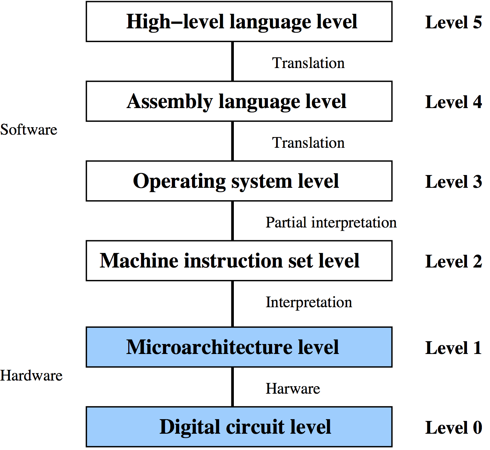

---

## 计算机硬件的组成

计算机硬件组成仍然遵从 von Neumann 结构

- 中央处理单元 CPU(控制器、运算器、寄存器) 

- 存储器 (内存储器、外存储器)

- 输入输出设备

- 互连设备

---

## 早期的 von Neumann 结构

以控制器为中心

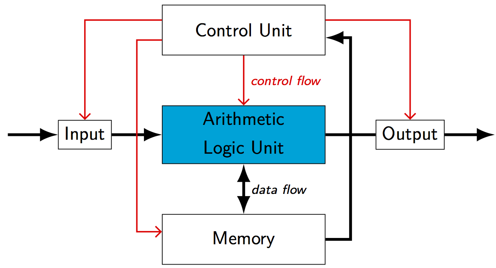

---

## 改进的 von Neumann 结构

以存储器为中心

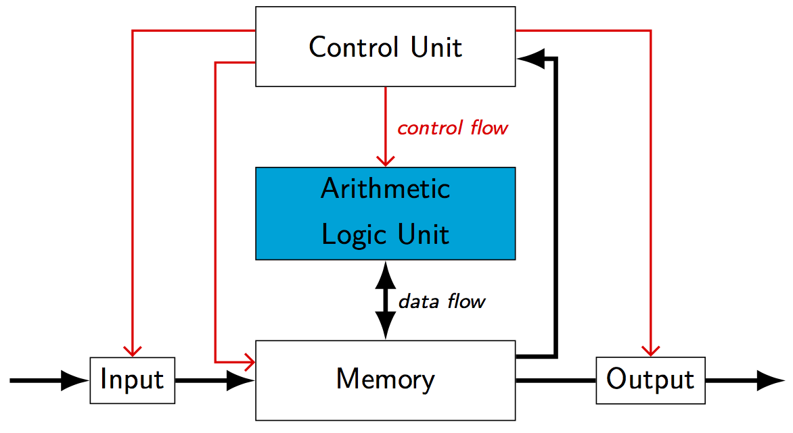

---

## CPU(Central Processing Unit) 组成

- CPU 负责解释执行程序中的指令, 处理数据

- 现代 CPU 主要包括三个部分: 算术逻辑单元 ALU、寄存器组、控制单元

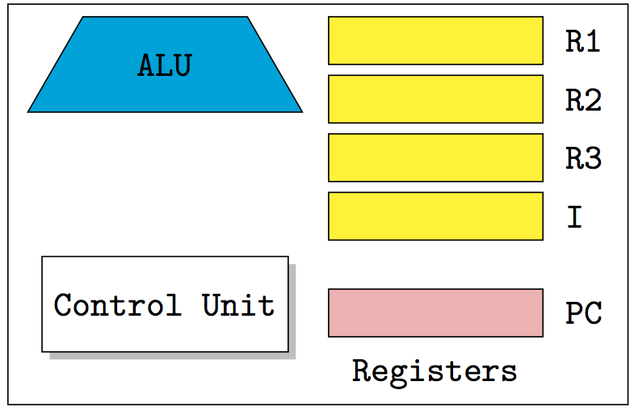

---

## CPU 内部结构

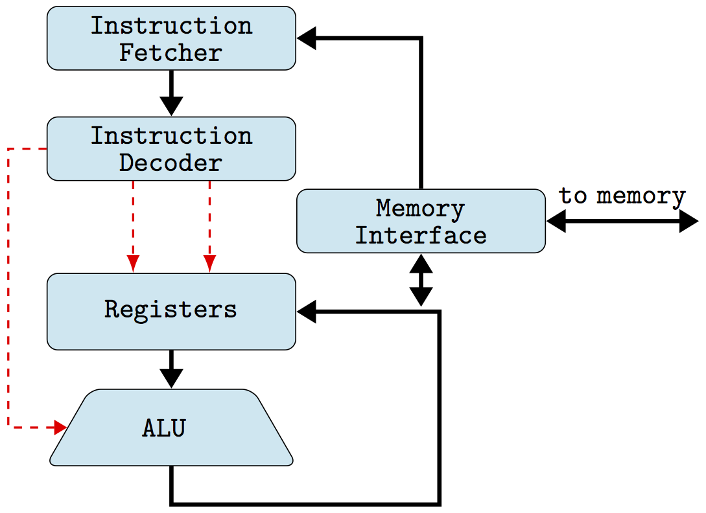

---

## 算术逻辑单元, ALU(Arithmetic Logic Unit)

ALU: CPU 中的主要部件, 进行算术运算, 逻辑运算与移位运算 

- 算术运算

    - 一元运算: 加1,减1 

    - 二元运算: 加法, 减法

- 逻辑运算 

    - 一元运算: "非"(not)

    - 二元运算: "与"(and)、"或"(or)、"异或"(xor) 

- 移位运算

    - 左移

    - 右移

---

## 逻辑运算

设 “0” 表示逻辑 “false”, “1” 表示逻辑 “true”, 则可以对二进制位进行逻辑运算

- "非"(NOT): 对输入位进行取反

- "与"(AND): 当且仅当输入全 1 结果为 1; 否则为 0

- "或"(OR): 当且仅当输入全 0 结果为 0; 否则为 1

- "异或"(XOR): 当且仅当输入相同结果为 0; 否则为 1

--

<hr>

求: 0x9A AND 0xC3 OR 0x44 XOR 0xAA

---

## 二元运算真值表

&nbsp;&nbsp;x&nbsp;&nbsp; |&nbsp;&nbsp; y&nbsp;&nbsp; |&nbsp;&nbsp; AND&nbsp;&nbsp; |&nbsp;&nbsp; OR&nbsp;&nbsp; |&nbsp;&nbsp; XOR&nbsp;&nbsp; 
:---:|:---:|:---:|:---:|:---:
0 | 0 | 0 | 0 | 0  
0 | 1 | 0 | 1 | 1  
1 | 0 | 0 | 1 | 1 
1 | 1 | 1 | 1 | 0 

---

## 移位运算, bit shift

位模式可以被左移或者右移. 只适用于无符号数.

- 左移: 去掉最左边的一位, 再将每一位左移, 最右位插入 0 

    - 左移相当于乘2
 
- 右移: 去掉最右边的一位, 再将每一位右移, 最左位插入 0 

    - 右移相当于除2

---

## 思考

1. 只用位操作和逻辑运算表示 x == y

2. 判断 x 的二进制位模式 1 的个数是否为奇数个, 1 是, 0 否 

3. 计算 x 的二进制位模式中有多少个 1

---

## 寄存器, processor register

- 寄存器是用于临时存放数据的最高速的存储单元

- CPU 对数据进行操作时, 要先将其从存储器取到寄存器中, 在寄存器中进行运算,然后将结果写回存储器
  
- 寄存器类型: 数据寄存器、指令寄存器、程序计数器、状态寄存器等


---

## 主存储器, memory

.left-column[
- 主存储器是存储单元的集合, 每个存储单元都有一个惟一的地址

- 存储器中的数据以 “字” 为单位操作与寻址
    - 字 (word): 通常是数据寄存器的位长 

    - 字节 (byte): 8 位

- 地址空间: 独立存储单元的总数
]
     
.right-column[

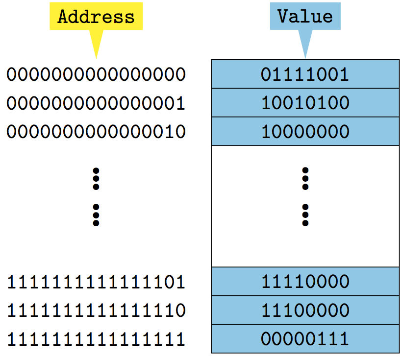

]

---

## 存储单位

SPACE;&nbsp;&nbsp;&nbsp;&nbsp; |&nbsp;&nbsp;&nbsp;&nbsp;-&nbsp;&nbsp; &nbsp;&nbsp;&nbsp;&nbsp; | Bits/byte&nbsp;&nbsp;&nbsp;&nbsp;  |&nbsp;&nbsp;&nbsp;&nbsp; Exact number of bytes&nbsp;&nbsp;&nbsp;&nbsp; 
:---|:---:| :--- | :---:
Kilobyte  | (K) | Thousand  | `\( 2^{10} \)`
Megabyte  | (M) | Million   | `\(2^{20}\)`
Gigabyte  | (G) | Billion   | `\(2^{30}\)`
Terabyte  | (T) | Trillion  | `\(2^{40}\)`
Petabyte  | (P) | Quadrillion | `\(2^{50}\)`
Exabyte   | (E) | Quintillion |  `\(2^{60}\)`
Zettabyte | (Z) | Sextillion  |  `\(2^{70}\)`

---

### 存储地址的计算

例: 计算机有 32MB(Megabyte) 内存, 需要多少位来寻址内存中的任意字节?

答: `\( 32M = 2^{25} \)`, 故需要25位

例: 计算机的地址空间为 32 位, 寻址单位为双字 (4 字节), 问内存总容量最大为多少?

答: `\( Mem_{max} = 2^{32} \times 4 = 4G \times 4 = 16G \)`

---

## 存储器的种类

主要有两种存储器: RAM 和 ROM

- RAM: 随机存取存储器 (Random Access Memory)

    - 可读写, 信息在断电后被擦除

    - SRAM: 静态 RAM, 速度快, 价格贵 

    - DRAM: 动态 RAM, 速度慢, 价格便宜
  
- ROM: 只读存储器 (Readonly Memory)

    - 断电不丢失数据

    - PROM, EPROM, EEPROM

---

## 存储器的层次结构

CPU 需要高速的存储器, 但是寄存器成本太高. 因此采取了层次结构的方案, 分别适应对速度、容量的需求


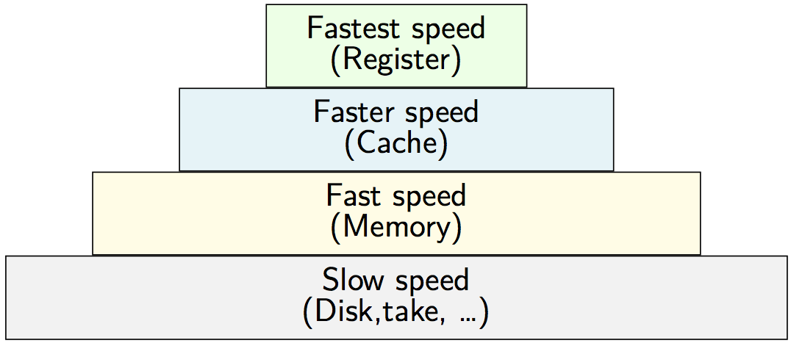

---

## 高速缓冲存储器, Cache


### 特点与原理

- Cache 的速度比主存快, 比寄存器慢; 容量比主存小很多, 比寄 存器大很多

- 局部性原理 (80/20 法则): Cache 效率要高, 算法很重要
  
### 工作步骤

1. CPU 访问 Cache

2. 若有数据, 则命中, 转4; 否则转3

3. 到内存中复制需要的数据块, 覆盖 Cache 的内容

4. CPU 存取 Cache

---

## 多级缓存

- L1 Cache: 第一级, CPU 内

- L2 Cache: 在 L1 Cache 和内存间


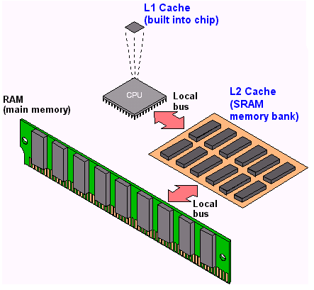

---


## 总线, bus

CPU 和主存间通过总线相连接. 总线由多根线组成, 每根线传输一位数据

- 数据总线: 线数取决于字长

- 地址总线: 线数取决于存储空间的大小 

- 控制总线: 线数取决于 CPU 控制命令的总数


---

## 程序中指令的执行

.left-column[
CPU 利用重复的机器周期来执行程序中的指令

1. 取指令 

2. 译码

3. 执行

指令的一般格式为:
   
操作码 | 操作数 | 操作数
]

.right-column[
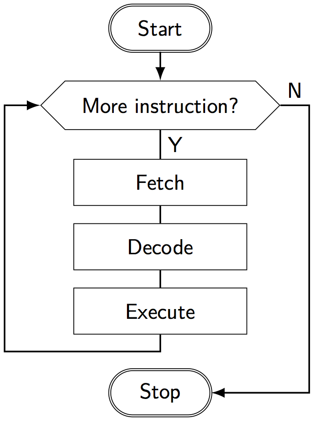
]

---

## 一个加法运算示例: 初始状态


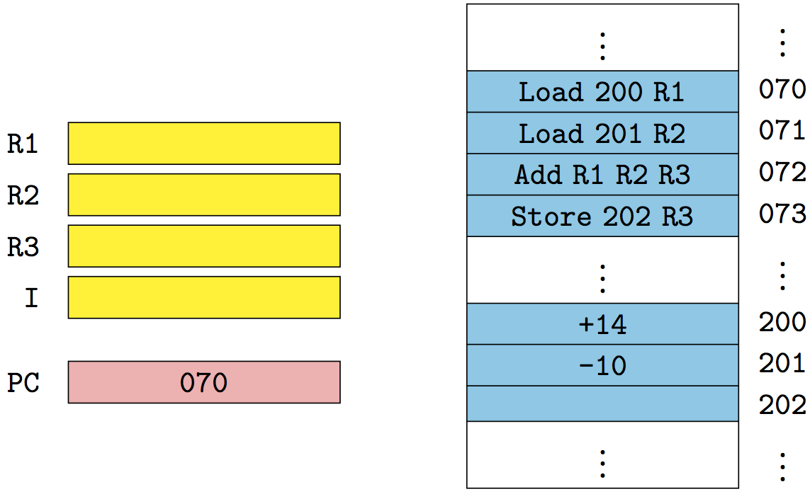

---

## 一个加法运算示例: 第 1 条指令


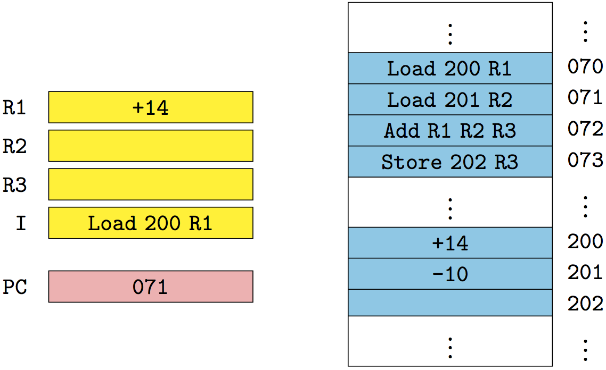

---

## 一个加法运算示例: 第 2 条指令

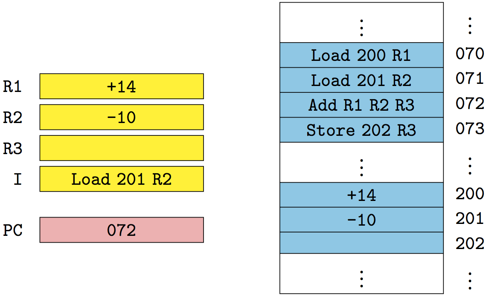

---

## 一个加法运算示例: 第 3 条指令

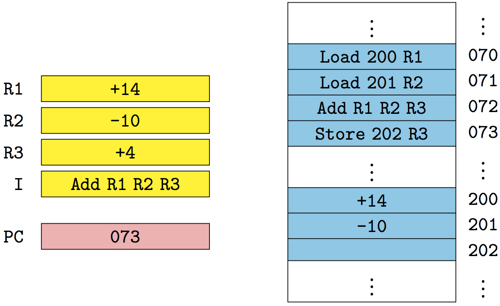

---

## 一个加法运算示例: 第 4 条指令

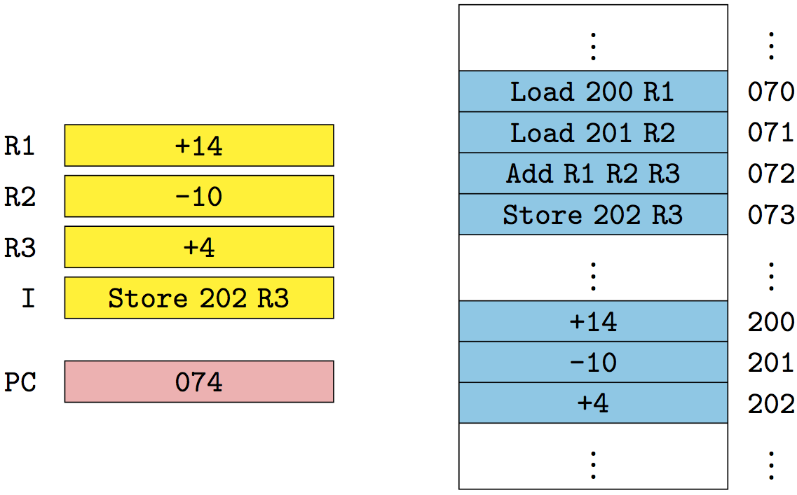

---

## 一个 hello 程序的执行

hello 程序:

```python
#!/usr/bin/python3

print("hello world")
```

用户在终端中输入 hello 命令执行

```sh
$ ./hello
```

---

## 运行 hello 程序的计算机系统

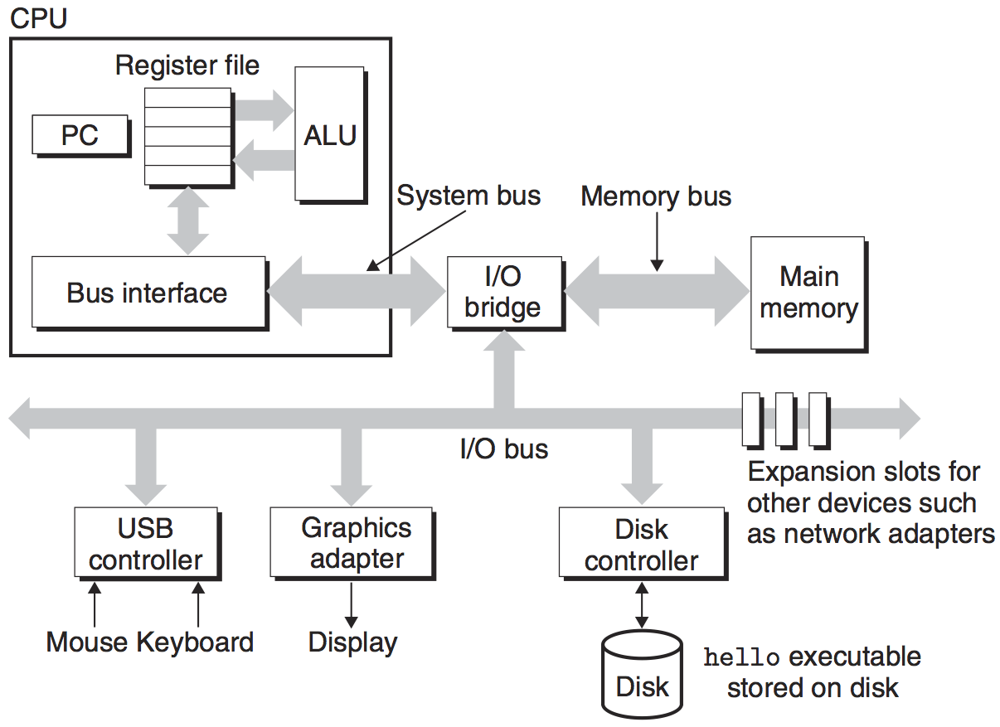

---

## 从键盘输入 hello 命令执行

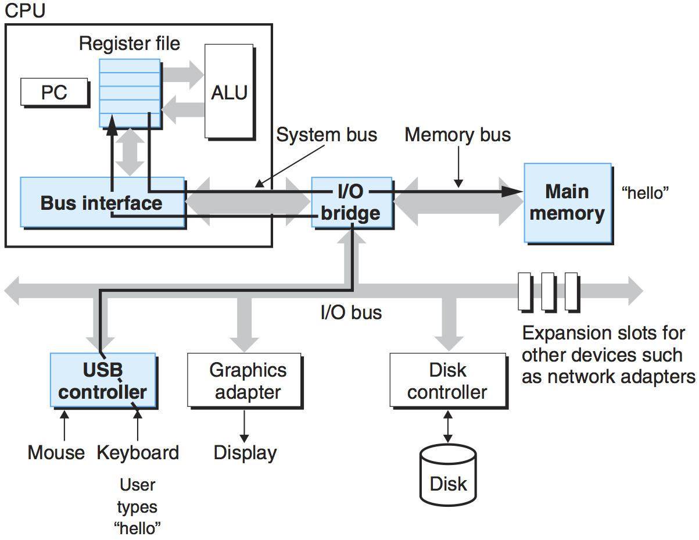

---

## 将 hello 程序调入内存

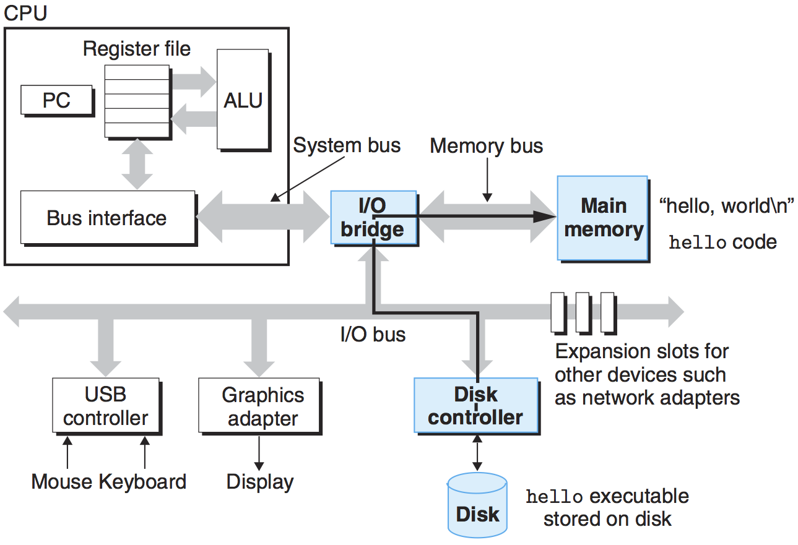

---

## hello 程序执行

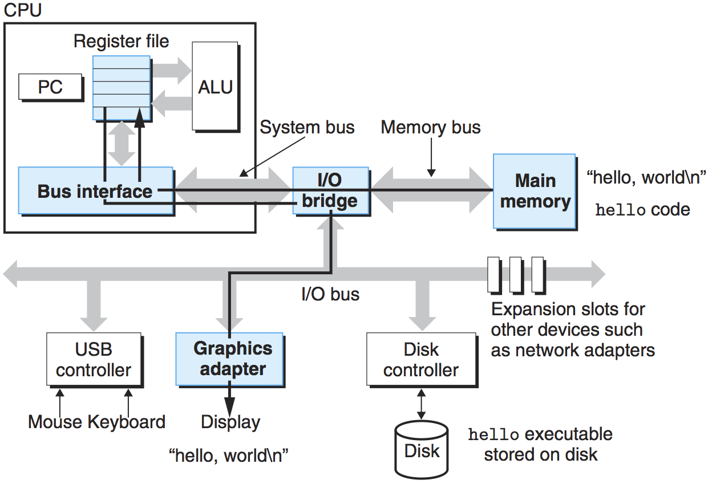

---

## 内容提要

### 1. 简介

### 2. CPU与存储器

### <font color="orangered">3. I/O设备</font> 

---

## I/O设备定义与类型

- I/O设备使得计算机能与外界交流信息

- I/O设备可以永久存储信息(程序和数据)

- I/O设备可分为两类

    - 非存储设备

    -  存储设备

---

## 非存储设备

- 键盘

- 鼠标

- 显示器

- 多媒体设备: 音箱、麦克风、声卡、摄像头等 

- 打印机: 激光打印机, 喷墨打印机, 针式打印机 

- 网卡

- 等等

---

## 存储设备

即通常意义上的外存储器, 或辅助存储设备

- 相对内存而言速度慢, 但便宜的多, 容量也大的多

- 数据可永久存储

- 按照存储介质的不同可分为

    - 磁介质存储设备

    - 光存储设备

    - 闪存设备

---

## 磁存储设备

- 使用磁性来存储数据为, 有磁性表示 1, 没有磁性表示 0 

- 常见设备: 硬盘、软盘、磁带等


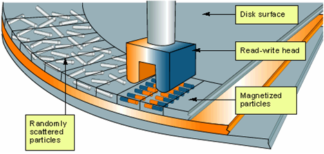

---

## 硬盘

- 构成: 盘面、磁道、扇区、柱面

- 存取: 随机存取

- 性能: 转速、寻道时间、传送时间、缓存


---

## 光盘

使用激光技术储存和访问数据

- CD: 存储音频

- CD-ROM: 只读光盘, 存储数据, 约 650MB 

- CD-R: 可刻录光盘

- CD-RW: 可读写光盘

- DVD-ROM: 容量 4.7GB 以上

- Blue-Ray: 

---

## I/O 设备的连接

CPU 是电子设备, I/O 设备多是机电、光学设备, 他们之间需要I/O 接口进行连接

- 串行连接: USB, FireWire, SATA, SAS

- 并行连接: ATA/IDE, ISA, PCI, SCSI

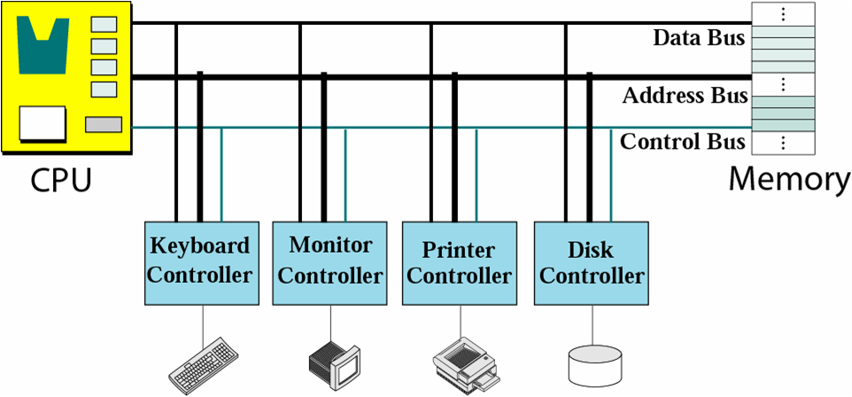

---

## 主板, motherboard

计算机的主要印刷电路板, 上有若干插槽, 用于集成CPU、内存、各种外设等


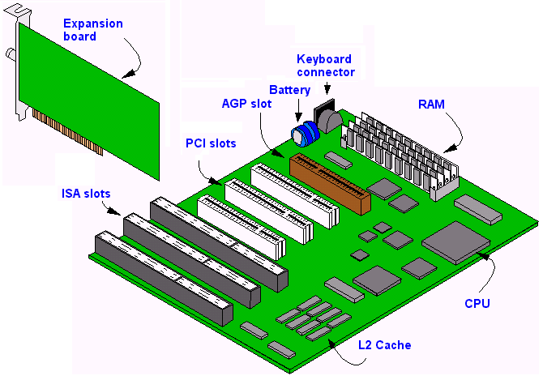

---

## Intel 850 芯片组连接示意图


---

## I/O 设备的寻址

- 通常 CPU 用相同的总线向内存和 I/O 读写数据, 所不同的在于指令

- 如果指令涉及输入输出设备, 则数据在 I/O 设备和 CPU 之间传送

- 两种寻址方式

    - I/O 独立寻址

    - I/O 存储器映射寻址

---

## I/O 独立寻址

读写内存和外设的指令不同, 故 I/O 设备的地址和内存的地址不会混淆


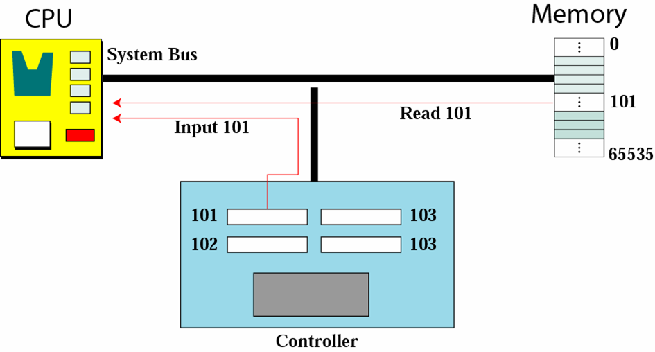

---

## I/O 存储器映射寻址

CPU 用相同的指令读写内存与外设

I/O 控制器中的存储器被看成是内存中的字, 占用了主存的地址空间


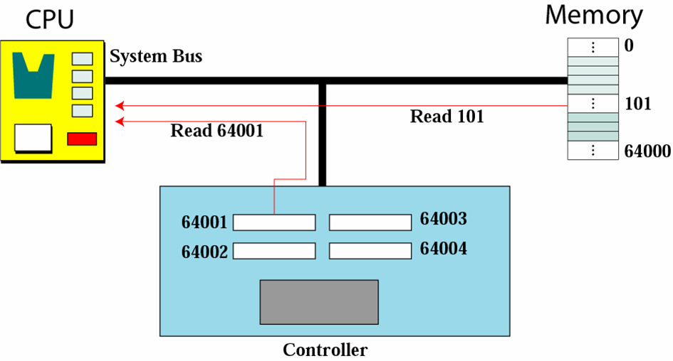

---

## I/O 操作

I/O 设备比 CPU 慢的多, 因此 CPU 必须和 I/O 设备同步 

- 程序控制输入输出

- 中断控制输入输出

- 直接存储器存取

---

## 程序控制输入输出: CPU等待I/O 设备

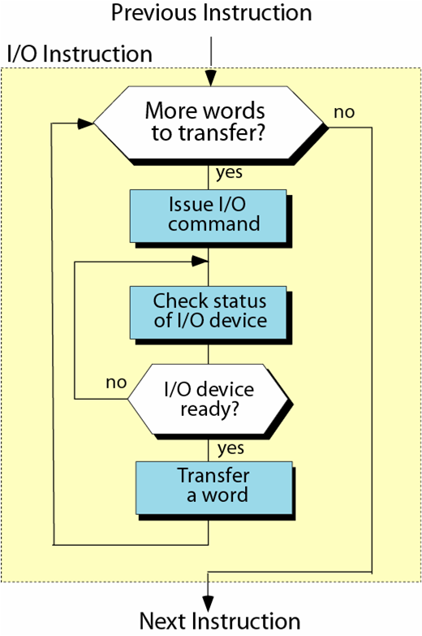

---

### 中断控制输入输出

I/O 设备准备好时通知 (interrupt)CPU, CPU 不必一直等待, 可以做别的工作

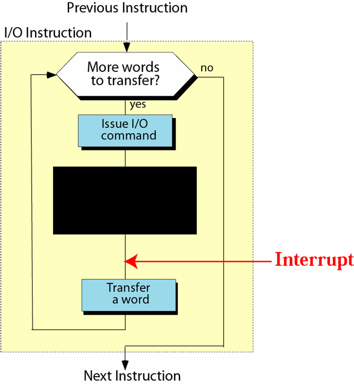

---

### 直接存储器存取, DMA

用于高速 I/O 设备和内存间的大数据传输, 数据传输不通过 CPU

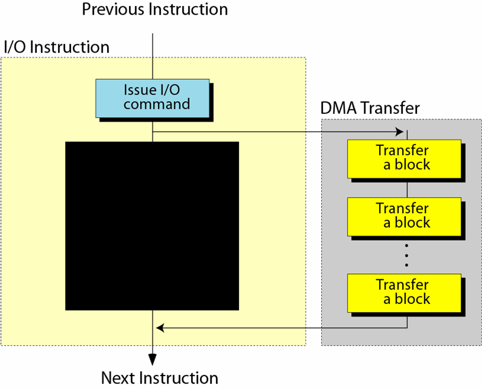

---

## 摩尔定律, Moore's Law

摩尔定律是由英特尔创始人之一戈登·摩尔1975年提出来的：

```txt
集成电路上可容纳的电晶体（晶体管）数目，约每隔24个月便会增加一倍。
```


还有一个“18个月”的版本，是由英特尔首席执行官大卫·豪斯所说：

```txt
预计18个月会将芯片的性能提高一倍，或价格下降一半。
```

还有一种说法:

```txt
用一个美元所能买到的电脑性能，每隔18个月翻两倍。
```

---


---

## 发展趋势

- 单处理器: 提高主频, 增强功能?

- 单处理器: 多核并行

- 单机: 多机并行

- 集中式: 分布式
