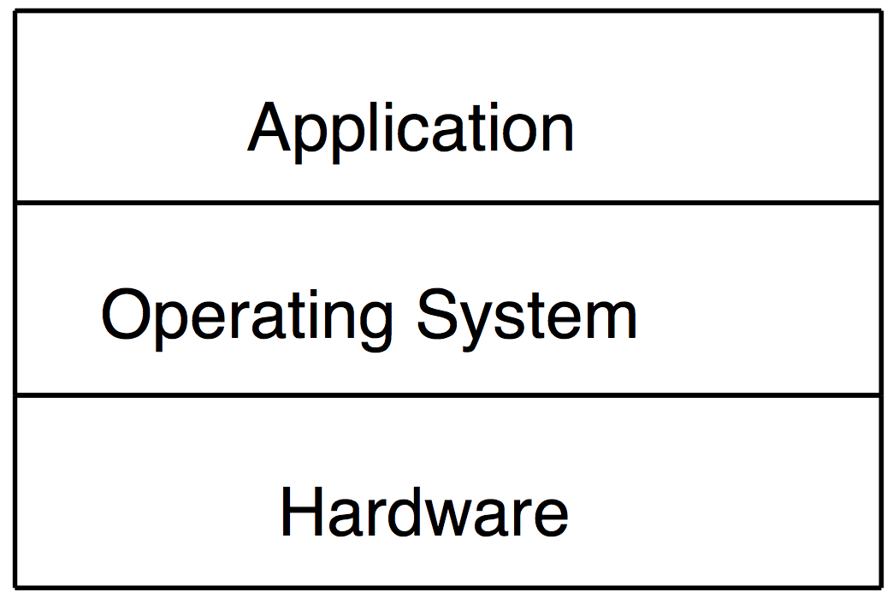
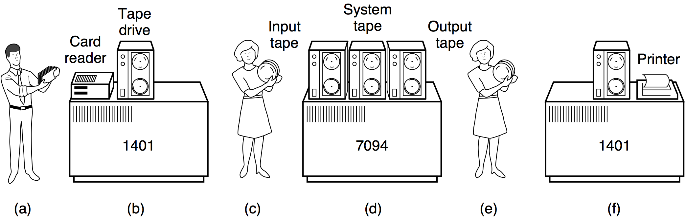
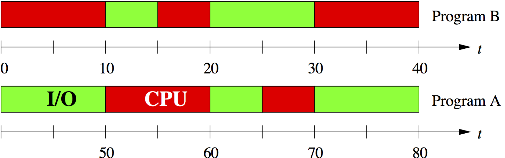
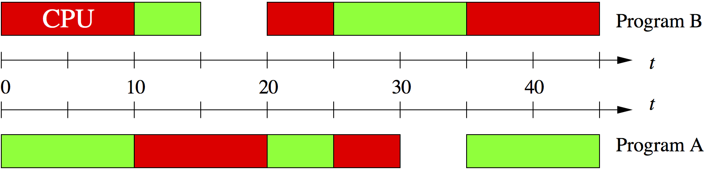

class: center, middle

# 04. 操作系统

### 计算概论B (化学)

&nbsp;
&nbsp;

#### 曹东刚 (caodg@pku.edu.cn)  

办公室: 理科1号楼1809

http://sei.pku.edu.cn/~caodg/course/ic

---

## 内容提要

### <font color="orangered">1. 概述</font> 

### 2. 进程管理

### 3. 存储管理

### 4. I/O与用户接口

---

## 操作系统能干什么

例: 在计算机上看 DVD

1. 将影碟放入 DVD 驱动器

2. 执行 DVD 播放软件

    - 操作系统从磁盘某个目录将播放程序调入内存

    - 操作系统创建一个进程, 执行该播放程序

3. DVD 播放软件读取 DVD 驱动器中的内容

4. 将数据送到屏幕和声卡的驱动程序

5. 用户享受 DVD

---

## 操作系统能干什么 —2

DVD 播放器 vs 操作系统

- DVD 驱动器  `\(\Longrightarrow\)` I/O 设备管理 

- 执行 DVD 播放软件

    - 磁盘上的播放程序: `\(\Longrightarrow\)` 文件系统 

    - 创建播放进程:  `\(\Longrightarrow\)` 进程管理、内存管理

- 驱动屏幕和声卡:  `\(\Longrightarrow\)` I/O 设备管理 

- 用户用鼠标进行操作:  `\(\Longrightarrow\)` 人机接口

---

## 从两个角度认识操作系统



- 自上而下: 将操作系统当作 .ored[虚拟机]

    - 将硬件细节与程序员隔离, 并提供一种简单易用的接口, 相当于为用户提供了一台等价的扩展机器

- 自下而上: 将操作系统当作 .ored[资源管理器]

    - 管理和协调对各种资源的使用

---

## 操作系统的功能组成

- 进程管理

- 存储管理

- 设备管理

- 文件管理

- 人机接口

---

## 操作系统的演化

- 批处理系统: 第二代计算机 

- 多道程序: 第三代计算机 

- 个人操作系统: 第四代计算机 

- 网络化操作系统: 网络时代

---

## 批处理系统, batch processing

- 最早为大型机设计, 提出了 “作业 (job)” 的概念 

- 作业的运行不需要人的交互, 可充分利用昂贵的计算资源 

- 现今仍可见于 Unix, Linux, Windows 等操作系统




---

## 多道程序, multiprogramming

### 产生背景

CPU速度快, 时间非常昂贵, 而外设速度很低. 一个程序如果等待外设的输入, 则会极大浪费 CPU.

### 技术特点

多个作业同时调入内存, 如果一个作业执行时要操作 I/O, 则把 CPU 让给其他作业执行.

- CPU 利用效率大大提高 

- 但是作业的完成时间仍然是不定的

---

## 单道程序 vs 多道程序: 执行效果

程序 A 和 B 在顺序执行的情况下





- CPU 利用率: 40/80 = 50% 

- I/O 利用率: 40/80 = 50%

---

## 单道程序 vs 多道程序: 执行效果

程序 A 和 B 在同时执行的情况下



- CPU 利用率: 40/45 = 89% 

- I/O 利用率: 40/45 = 89%

---

## 分时系统, time-sharing system

分时系统: 程序员希望计算机能及时响应交互 

- 从批处理模式发展到交互模式的必然结果

- 提出了 “进程 (process)” 的概念

- 时间分片, 多个用户同时使用, CPU 轮流为其服务, 每个人感觉独占整个系统

- 本质上是特殊的多道程序

---

## 个人计算机操作系统

特点

- 用户友好 (user-friendly), 高品质的图形化交互

- 用户不需要专业的计算机知识

两种主流的个人计算机操作系统

- 单用户: 微软的Windows 系列, 苹果公司的 Mac OS X 系列, 常见于个人
PC

- 多用户: Unix/Linux 系列, 常见于工作站、服务器

---

## 典型 OS: Unix

```txt
Unix 是 1960 年代末贝尔实验室开发的一种一流操作系统, 应用最广泛, 曾统治了

工作站/服务器等领域
```

- 可移植, 多任务, 多用户, 分时 

- C 语言, C/S 模型

- Unix 哲学和文化, 开放系统 

- 众多分支, Unix 战争, POSIX

    - BSD 系列: Solaris, Mac OS X, FreeBSD 

    - System V 系列: HU-UX, IBM AIX, SGI IRIX

---

## 典型 OS: GNU/Linux

```txt
Linux 是一种类 Unix(Unix-like) 系统, 近年迅速发展, 主要用于工作站、

PC机、嵌入式系统等
```

- 1980 年代自由软件基金会决定启动 GNU(GNU is Not Unix) 项目, 开发一个完全免费的 Unix 系统

- 1991年, 大二学生Linus Torvalds 发布了Linux内核的第一个版本 

- GNU 工具 + Linux 内核 = GNU/Linux 操作系统 

- Unix 的所有技术特征 + 开放源码

- 众多的 Linux 发行版本, 全部开源: Debian, Fedora, SUSE, Ubuntu, RedFlag ...

---

## Ubuntu 15.10


---

## 典型 OS: 智能终端 OS

.left-column[


]

.right-column[


]

&nbsp;

.left-column[


]

.right-column[

]

&nbsp;
&nbsp;


---

## 内容提要

### 1. 概述 

### <font color="orangered">2. 进程管理</font>

### 3. 存储管理

### 4. I/O与用户接口

---

## 进程管理

### 为什么需要进程管理

现代计算机的 CPU 和多数 I/O 设备同一时刻只能处理一个任务, 如何满足多道
程序的各个程序同时运行的需求?


### 进程模型

进程是操作系统描述计算机并发活动的一种模型 

- 进程是操作系统最核心的概念,是资源分配和调度的单位 

- 进程描述活动, 包括程序、数据、执行状态等 

- 各个进程共享处理机

---

## 内容提要

### 1. 概述 

### 2. 进程管理

### <font color="orangered">3. 存储管理</font>

### 4. I/O与用户接口

---

## 内容提要

### 1. 概述 

### 2. 进程管理

### 3. 存储管理

### <font color="orangered">4. I/O与用户接口</font>

---

