class: center, middle

# 04. 操作系统

### 计算概论B (化学)

&nbsp;
&nbsp;

#### 曹东刚 (caodg@pku.edu.cn)  

办公室: 理科1号楼1809

http://sei.pku.edu.cn/~caodg/course/ic

---

## 内容提要

### <font color="orangered">1. 概述</font> 

### 2. 进程管理

### 3. 存储管理

### 4. I/O与用户接口

---

## 操作系统能干什么

例: 在计算机上看 DVD

1. 将影碟放入 DVD 驱动器

2. 执行 DVD 播放软件

    - 操作系统从磁盘某个目录将播放程序调入内存

    - 操作系统创建一个进程, 执行该播放程序

3. DVD 播放软件读取 DVD 驱动器中的内容

4. 将数据送到屏幕和声卡的驱动程序

5. 用户享受 DVD

---

## 操作系统能干什么 —2

DVD 播放器 vs 操作系统

- DVD 驱动器  `\(\Longrightarrow\)` I/O 设备管理 

- 执行 DVD 播放软件

    - 磁盘上的播放程序: `\(\Longrightarrow\)` 文件系统 

    - 创建播放进程:  `\(\Longrightarrow\)` 进程管理、内存管理

- 驱动屏幕和声卡:  `\(\Longrightarrow\)` I/O 设备管理 

- 用户用鼠标进行操作:  `\(\Longrightarrow\)` 人机接口

---

## 从两个角度认识操作系统

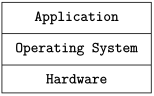

- 自上而下: 将操作系统当作 .ored[虚拟机]

    - 将硬件细节与程序员隔离, 并提供一种简单易用的接口, 相当于为用户提供了一台等价的扩展机器

- 自下而上: 将操作系统当作 .ored[资源管理器]

    - 管理和协调对各种资源的使用

---

## 操作系统的功能组成

- 进程管理

- 存储管理

- 设备管理

- 文件管理

- 人机接口

---

## 操作系统的演化

- 批处理系统: 第二代计算机 

- 多道程序: 第三代计算机 

- 个人操作系统: 第四代计算机 

- 网络化操作系统: 网络时代

---

## 批处理系统, batch processing

- 最早为大型机设计, 提出了 “作业 (job)” 的概念 

- 作业的运行不需要人的交互, 可充分利用昂贵的计算资源 

- 现今仍可见于 Unix, Linux, Windows 等操作系统


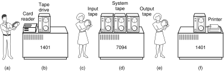

---

## 多道程序, multiprogramming

### 产生背景

CPU速度快, 时间非常昂贵, 而外设速度很低. 一个程序如果等待外设的输入, 则会极大浪费 CPU.

### 技术特点

多个作业同时调入内存, 如果一个作业执行时要操作 I/O, 则把 CPU 让给其他作业执行.

- CPU 利用效率大大提高 

- 但是作业的完成时间仍然是不定的

---

## 单道程序 vs 多道程序: 执行效果

程序 A 和 B 在顺序执行的情况下


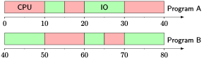


- CPU 利用率: 40/80 = 50% 

- I/O 利用率: 40/80 = 50%

---

## 单道程序 vs 多道程序: 执行效果

程序 A 和 B 在同时执行的情况下

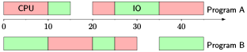

- CPU 利用率: 40/45 = 89% 

- I/O 利用率: 40/45 = 89%

---

## 分时系统, time-sharing system

分时系统: 程序员希望计算机能及时响应交互 

- 从批处理模式发展到交互模式的必然结果

- 提出了 “进程 (process)” 的概念

- 时间分片, 多个用户同时使用, CPU 轮流为其服务, 每个人感觉独占整个系统

- 本质上是特殊的多道程序

---

## 个人计算机操作系统

特点

- 用户友好 (user-friendly), 高品质的图形化交互

- 用户不需要专业的计算机知识

两种主流的个人计算机操作系统

- 单用户: 微软的Windows 系列, 苹果公司的 Mac OS X 系列, 常见于个人
PC

- 多用户: Unix/Linux 系列, 常见于工作站、服务器

---

## 典型 OS: Unix

```txt
Unix 是 1960 年代末贝尔实验室开发的一种一流操作系统, 应用最广泛, 曾统治了

工作站/服务器等领域
```

- 可移植, 多任务, 多用户, 分时 

- C 语言, C/S 模型

- Unix 哲学和文化, 开放系统 

- 众多分支, Unix 战争, POSIX

    - BSD 系列: Mac OS X, Darwin, FreeBSD, OpenBSD, NetBSD

    - System V 系列: Solaris, HU-UX, IBM AIX, SGI IRIX

---

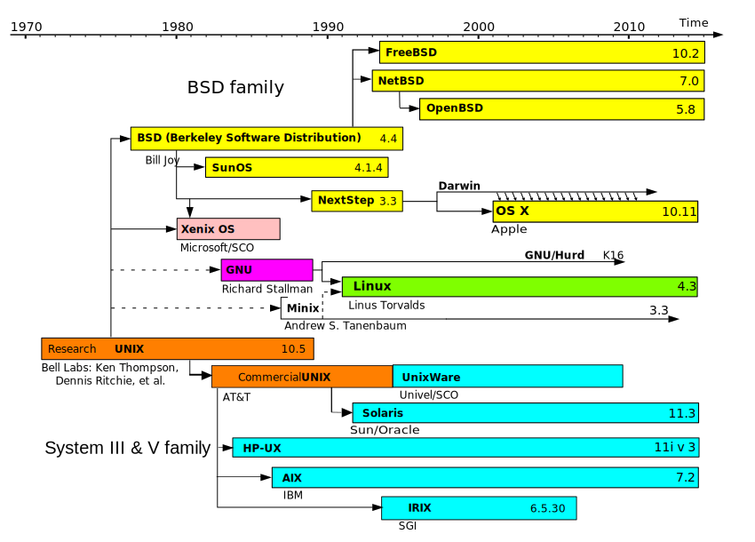

---


---

## Berkeley Software Distribution (BSD)

BSD原指 UC Berkeley 1977 - 1995年间开发和发布的Unix操作系统. 现指任何BSD
衍生的类Unix操作系统.

.left-column[
- Berkeley Unix: 4.3BSD, 4.4BSD

- 386BSD

    - FreeBSD, OpenBSD, NetBSD

    - Apple Darwin
]

.right-column[

]

&nbsp;

<table id="mytb">
<tr>
<td>

</td>
<td>
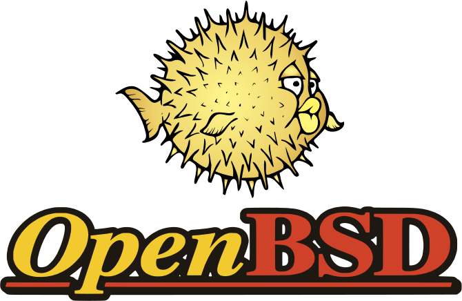
</td>
<td>

</td>
<td>

</td>
</tr>
</table>


---

## 典型 OS: Linux

```txt
Linux 是一种类 Unix(Unix-like) 系统, 近年迅速发展, 广泛用于工作站、

PC机、手机、嵌入式系统等各种环境
```


- Unix 的版权问题, Minix 的版权问题, GNU项目进展问题

- 1991年, 大二学生Linus Torvalds 发布了Linux内核的第一个版本, 公开源码

- Unix 的所有技术特征 + 开放源码

- 有众多Linux发行版, 众多Linux 社区

.left-column[

]

.right-column[

]

---

## 众多的 Linux 发行版本

- Debian系: Debian, Ubuntu, Knoppix, Linux Mint, ...

<table id="mytb">
<tr>
<td align="center" valign="bottom">

</td>
<td align="center" valign="bottom">

</td>
<td align="center" valign="bottom">
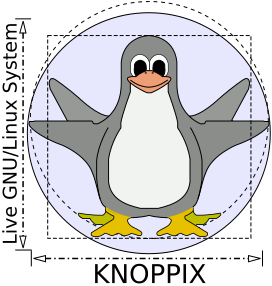
</td>
<td align="center" valign="bottom">

</td>
</tr>
</table>

- Red Hat系: Red Hat Enterprise Linux, Fedora, CentOS, Scientific Linux, ...

<table id="mytb">
<tr>
<td align="center" valign="bottom">

</td>
<td align="center" valign="bottom">

</td>
<td align="center" valign="bottom">

</td>
<td align="center" valign="bottom">

</td>
</tr>
</table>

- Slackware, Gentoo, OpenSUSE, Arch, Chromium OS, ...

<table id="mytb">
<tr>
<td align="center" valign="bottom">

</td>
<td align="center" valign="bottom">

</td>
<td align="center" valign="bottom">

</td>
<td align="center" valign="bottom">

</td>
<td align="center" valign="bottom">

</td>
</tr>
</table>

---

## Ubuntu 15.10

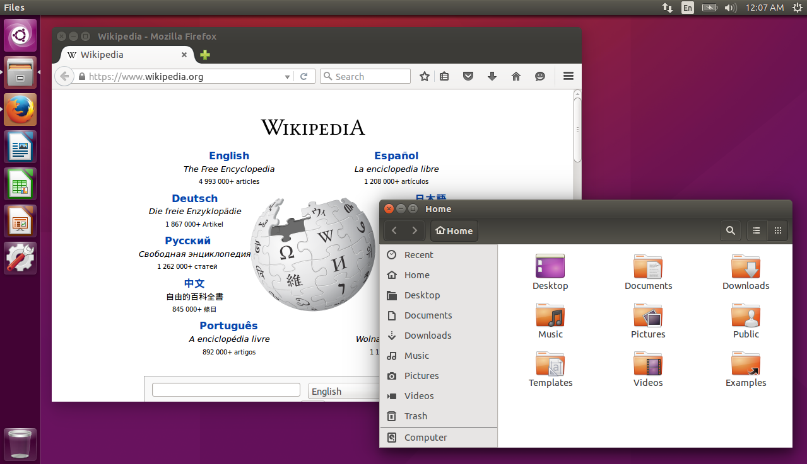

---

## Linux 的广泛适用性


---

## Linux UI 工具栈

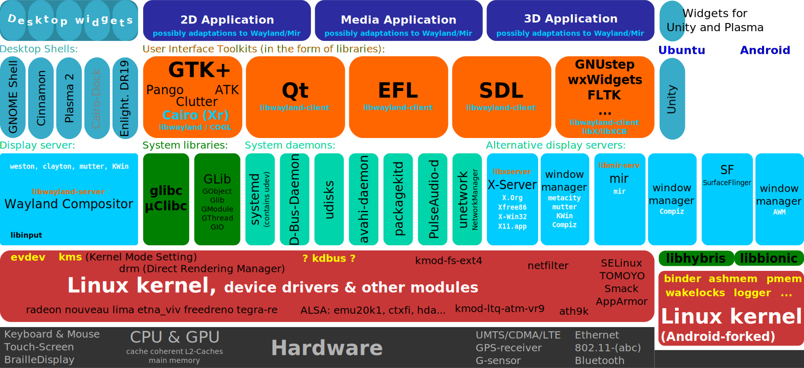

---


## 典型 OS: 智能终端 OS

.left-column[


]

.right-column[


]


.left-column[


]

.right-column[

]


.left-column[

]

---

## 操作系统份额: 全球设备预装

Source | Year | Android | iOS/OS X | Windows | Others 
-------|------|---------|----------|---------|-------
Gartner|2015  | 1.3 billion (54%) | 297 million (12.3%) | 283 million (11.7%) | ~520 million (21.6%)
Gartner|2014  | 48.61%  | 11.04%   | 14.0%   | 26.34%
Gartner|2013  | 38.51%  | 10.12%   | 13.98%  | 37.41%
Gartner|2012  | 22.8%   | 9.6%     | 15.62%  | 51.98%

---

## 操作系统份额: 分类统计

Category | Source | Year | Linux | Unix | Windows 
-------|------|---------|----------|---------|-------
Desktop, laptop | Net Applications |2016.7 | 2.33%  | 7.87% | 89.79%   
Smartphone | StatCounter |2016.5 | 64.89%  | 23.56% | 1.7%   
Server | W3Techs | 2014.9 | 36.72% | 30.18% | 33.10%
Supercomputer | TOP500 | 2016.6 | 99.79% | 0.21% | 0%
Game Console | StatCounter | 2016.6 | 0% | 70.78% | 23.28%

---

## GNU(GNU is Not Unix), 开源运动

Richard Matthew Stallman(RMS) 对软件知识产权保护制度不满, 提出自由软件
(Free Software) 理念

.left-column[
- 1983年, RMS 启动 GNU项目, 开发一个自由的类Unix 系统

    - 成果: gcc, glibc, coreutils; gdb, emacs, binutils, bash, gnome 

    - GNU 内核(Hurb)开发进展缓慢

    - Linux 内核 + GNU 工具 ➔ GNU/Linux 

- 1989年, GNU General Public License (GPL)发布

- 2015年, Debian GNU/HURD 2015 发布, 完整的 GNU OS 出现
]

.right-column[


]

---

## *Free as in Freedom*

.left-column[

*Free as in Freedom: Richard Stallman's Crusade for Free Software*
is a free book licensed under the GNU Free Documentation
License about the life of Richard Stallman, written by Sam Williams and
published by O'Reilly Media on March 1, 2002.

- free to study the source code of the software they use

- free to share the software with other people 

- free to modify the behavior of the software

- and free to publish their modified versions of the software
]

.right-column[
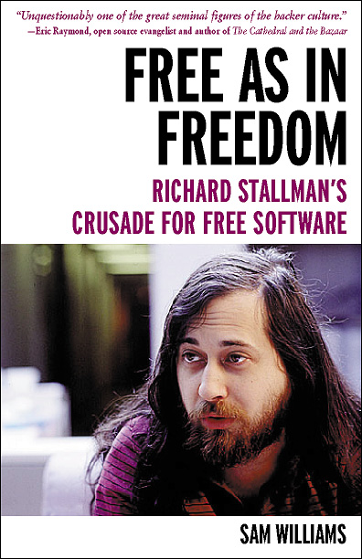
]


---

## Free as in Freedom 2.0: Free Softare, Free Society


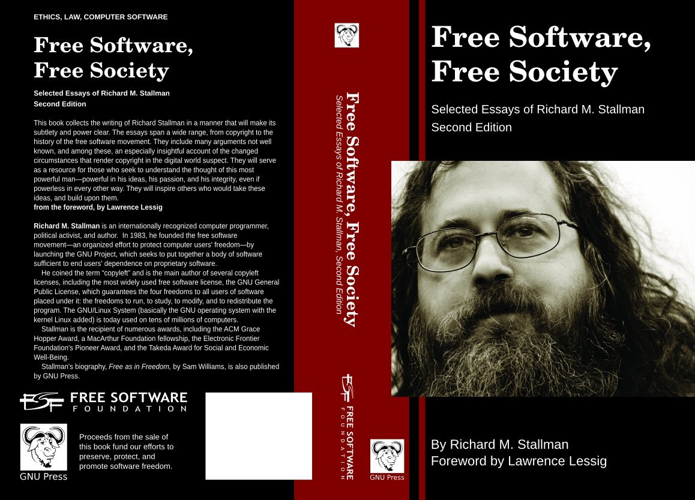

---

## 从自由软件, 到开源软件, 到开源运动

- *Free Software* 的理念蕴含对抗现有知识产权保护制度, 很多厂商及黑客反对

- IETF, FSF, X, Apache, Linux 等各种开放源码社区并存发展

- 1998年开源社区峰会, 决定以 **`开源`** 作为黑客们的共同旗帜

- 2005年之后, IBM, Google, Yahoo, Amazon 等商业公司大规模投入, 开源模式
  深刻影响社会和产业的发展, 形成超越软件领域的开源运动


<table id="mytb">

<tr>
<td>

</td>
<td>
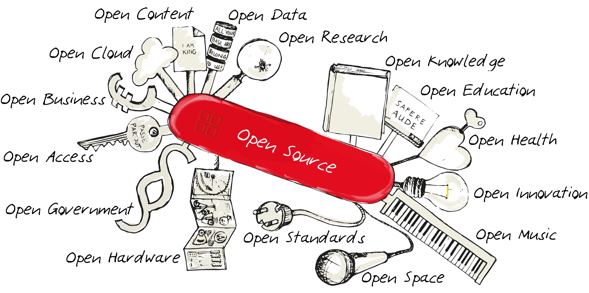
</td>
</tr>
</table>


---

## 内容提要

### 1. 概述 

### <font color="orangered">2. 进程管理</font>

### 3. 存储管理

### 4. I/O与用户接口

---

## 进程管理

### 为什么需要进程管理

现代计算机的 CPU 和多数 I/O 设备同一时刻只能处理一个任务, 如何满足多道
程序的各个程序同时运行的需求?


### 进程模型

进程是操作系统描述计算机并发活动的一种模型 

- 进程是操作系统最核心的概念,是资源分配和调度的单位 

- 进程描述活动, 包括程序、数据、执行状态等 

- 各个进程共享处理机

---

## 程序, 作业, 进程

作业是一个面向用户的概念, 进程是一个面向 CPU 调度和 执行的概念

程序

- 程序员编写的静态指令集, 不占用 CPU 资源 

作业

- 用户向计算机提交的任务实体, 通常体现为用户运行一个程序

进程

- 计算机为了完成用户任务实体而设置的执行实体

---

## 程序与进程 — 场景 1

计算机科学家 Mr. CS 要为其女儿做蛋糕. 他有

- 做蛋糕的食谱 `\( \Longrightarrow \)`  程序 

- 面粉、鸡蛋、糖等原料 `\( \Longrightarrow \)` 输入数据

- 烤箱 `\( \Longrightarrow \)` 外设

- Mr. CS 的双手 `\( \Longrightarrow \)` CPU

- Mr. CS 的大脑 `\( \Longrightarrow \)` 操作系统

- Mr. CS 为女儿做蛋糕这件事情 `\( \Longrightarrow \)` 作业

- Mr. CS 阅读食谱, 按照食谱取原料、制作的一系列动作 `\( \Longrightarrow \)` 进程

---

## 程序与进程 — 场景 2

Mr. CS 的儿子突然跑进来求助: 他被蜜蜂蜇了 (需要紧急处理) 

- Mr. CS 需要马上中断做蛋糕的事情，转而进行疗伤(高优先级进程)

- 他记录下当前做到哪儿了 `\( \Longrightarrow \)` 保存进程状态 

- 取出急救手册(程序), 开始疗伤(高优先级进程抢占CPU, 低优先级进程挂起)

- 治疗结束, Mr. CS 继续做蛋糕  `\( \Longrightarrow \)` 恢复保存的现场，作蛋糕进程重新获得 CPU

---

## 进程状态


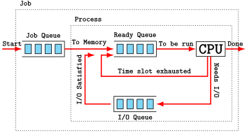

---

## 进程的实现

为实现进程模型, 操作系统维持着一张关于进程的表格, 每个进程占用一项, 包含

- 进程状态

- 各寄存器的当前值 

- 进程标识号 

- 正文段、数据段指针 

- 工作目录、打开文件的描述符 

- ...

---

## 进程调度

进程调度要考虑多种要素

- 公平: 每个进程获得合理的 CPU 份额 

- 效率: 使 CPU 利用率最高

- 响应时间: 使交互用户的响应时间尽可能短 

- 周转时间: 使作业的完成时间尽可能短 

- 吞吐量: 使单位时间处理的作业足够多

---

## 进程调度算法

时间片轮转调度 (round robin)

- 每个进程被分配一个时间段 (quantum), 在该时间段结束后若该进程未结束, 则CPU 被剥夺给其它进程

- 需要权衡时间片的长短


优先级调度

- 进程被赋予一个优先级, 优先级最高的就绪进程被优先执行 

- 需要防止低优先级的进程饿死

---

## 死锁与饿死

### 死锁 (deadlock)

进程独占了部分资源却无法执行, 导致其它需要该资源的进程也无法执行


### 饿死 (starve)

某些进程永远得不到机会执行, 破坏了公平原则

---

## 哲学家进餐问题 

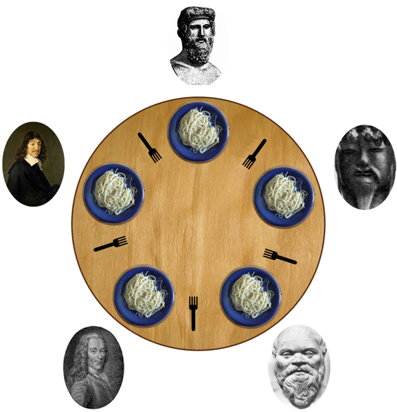

---

## 内容提要

### 1. 概述 

### 2. 进程管理

### <font color="orangered">3. 存储管理</font>

### 4. I/O与用户接口

---

## 储管理的任务

帕金森定律: 存储器有多大, 程序就有多大 

存储管理的主要任务

- 记录哪些内存正在使用, 哪些是空闲的 

- 在进程需要时为其分配存储空间 

- 在进程结束后释放存储空间

- 在内存无法装入所有进程时, 在内存和磁盘间进行交换 (swap)

---

## 存储管理系统分类

- 程序在运行期间始终驻留在内存中 

    - 分区调度

    - 分页调度

- 程序在运行期间可以在内存和外存之间多次交换

    - 请求分区调度

    - 请求分页调度

---

## 分区调度

内存被划分为不定长分区, 每个分区容纳一个程序

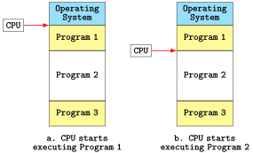

---

## 分页调度

- 内存被划分为若干定长的帧 (frame), 程序则划分为与帧等长的页 (page). 

- 程序在内存中不必连续存放

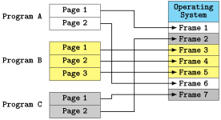

---

## 交换内存管理

在分时系统中, 用户的进程数目比内存所能容纳的要多, 因此需要在磁盘上保存
那些内存放不下的进程; 要运行这些进程时, 才调入内存. 

进程在内存和磁盘之间的移动称为交换 (swapping)

- 请求分区调度: 从程序员的角度, 将每个程序逻辑上分为数据区、代码区等

- 请求分页调度: 页不必全部装入内存

---

## 虚拟存储器, Virtual Memory

思想: 程序的大小可以超过可用的物理内存大小, 由操作系统自动决定哪些部分
保留在内存, 哪些保存在磁盘.


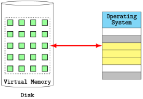

---

## 文件系统

计算机存储信息的基本需求

- 能存储极大量的信息
- 可以长期保存信息
- 支持信息的共享

文件:

```txt
一种信息抽象机制, 将信息以结构化的方式组织起来进行管理,使用户不必了解信息
如何存储在底层磁盘的工作细节
```


目录: 

```txt
文件系统需要一种机制将文件组织在一起, 通常用目录记录文件的信息。
目录是一种特殊的文件
```

---

## 文件命名

不同操作系统对文件的命名规则各不相同. 下面是良好的命名习惯

- 注意区分大小写

- 尽量用 ASCII 字母、数字命名 

- 尽量不要出现空格、特殊字符 

- 尽量不要用中文 

- 文件名要有意义

---

## 路径, path

- 根目录: 文件系统的最顶层目录，如D:\

- 工作目录: 用户进程的当前目录, 如D:\Data 

- 当前目录: 用户或进程当前所处的目录

- 父目录: 上一级目录

- 路径分隔符: 如Windows 系统中的\，Linux系统中的 /

- 绝对路径: 从根目录开始的路径, 如 D:\Data\Work\read.txt 

- 相对路径: 从当前目录开始的路径, 如 Work\read.txt

---


## 内容提要

### 1. 概述 

### 2. 进程管理

### 3. 存储管理

### <font color="orangered">4. I/O与用户接口</font>

---

## 友好的人机交互接口

- 命令行接口: Command Line Interface (CLI)

    - 从文本终端手工输入命令, 计算机将结果输出到终端的交互 方式

- 文本用户接口: Text User Interface (TUI) 

    - 基于文本终端的类 GUI 交互方式

- 图形用户接口: Graphical User Interface (GUI) 

    - 通过直接操作图标等图形化元素和计算机交互

- 浏览器用户接口: Browser User Interface (BUI)

    - 基于浏览器的图形化交互方式

---

## CLI


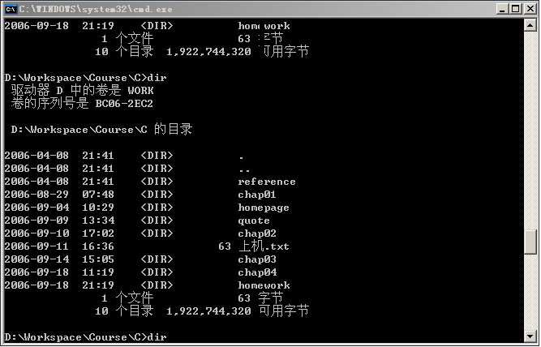

---

## GUI


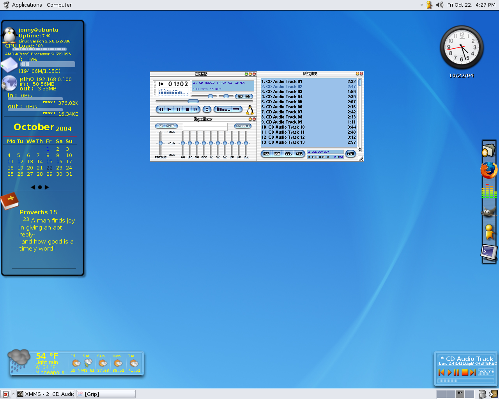

---

## BUI

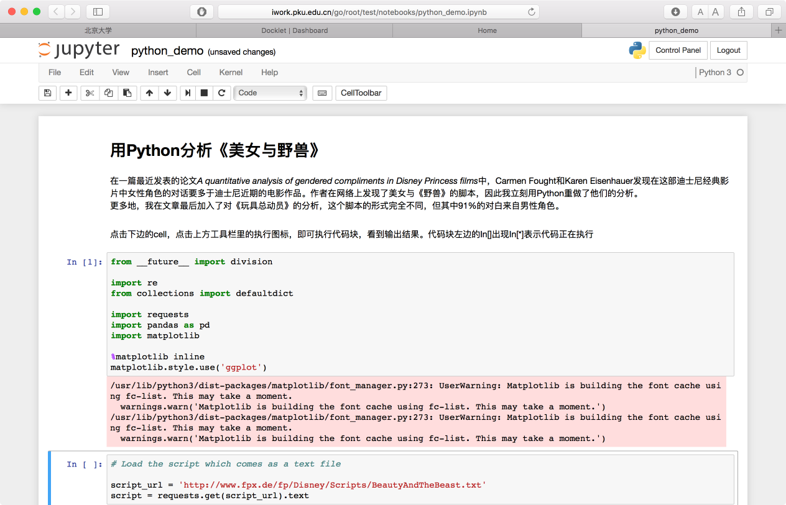
